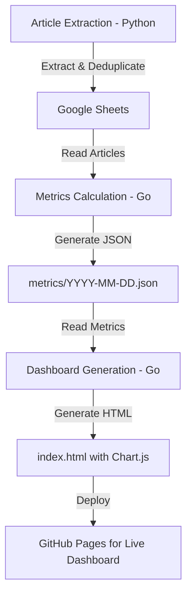

# 📚 Personal Reading Analytics Dashboard

A self-built fully automated reading analytics dashboard with zero infrastructure, refreshed automatically to turn personal data into actionable insights.

---

## 🌿 Design Philosophy

This project is built to reflect how I believe small, personal tools should work:

- **Zero infrastructure** → No servers, databases, or cloud costs. Runs entirely on GitHub (Actions + Pages).  
- **Fully automated** → Scheduled GitHub Actions keep data fresh—no manual runs or home servers.  
- **Transparent by default** → All code, data logic, and outputs are public. No black boxes.  
- **Sustainable & low-stress** → Simple pipeline, easy to maintain, no roadmap pressure. It evolves only when real needs arise.  
- **Cost-effective** → Uses only free tiers (GitHub, Google Sheets API)—proving powerful automation doesn’t require budget.

---

## 📊 What It Shows

- Total articles read (3000+ and counting)  
- Read vs. unread by source (Shopify, FCC, Stripe, etc.)  
- Yearly/monthly trends  
- Interactive charts

### Supported Sources

Currently extracting articles from:

- freeCodeCamp
- Substack
- GitHub (Added 2024-03-18)
- Shopify (Added 2025-03-05)
- Stripe (Added 2025-11-19)  

---

## 🔗 Live Dashboard

👉 [Live Demo](https://victoriacheng15.github.io/personal-reading-analytics-dashboard/)

---

## 🛠 Tech Stacks

---

## 🛠️ Technical Overview

### Data Pipeline: Articles → Metrics → Dashboard

**Article Extraction**: Python web scrapers extract articles from engineering sources, deduplicate, and store in Google Sheets

**Metrics Calculation**: Go program reads articles from Google Sheets, calculates metrics, outputs JSON

**Dashboard Generation**: Go program reads metrics JSON, generates interactive HTML with Chart.js visualizations, deploys to GitHub Pages

### Documentation

For deep technical details, see the architecture docs:  

- [Extraction Pipeline Design](docs/extraction_architecture.md)  
- [Dashboard Pipeline Design](docs/dashboard_architecture.md)  
- [GitHub Actions Workflows](docs/github_actions.md)  
- [Jenkins CI/CD](docs/jenkins.md) - Comparison with GitHub Actions

---

## 📖 How This Project Evolved

Learn about the journey of this project: from local-only execution, to Docker containerization, to fully automated GitHub Actions workflows.

[Read Part 1: Article Extraction Pipeline](https://victoriacheng15.vercel.app/blog/from-pi-to-cloud-automation)

**Part 2: Dashboard & Metrics Pipeline** (Coming soon) - The evolution to metrics calculation and interactive visualization on GitHub Pages
