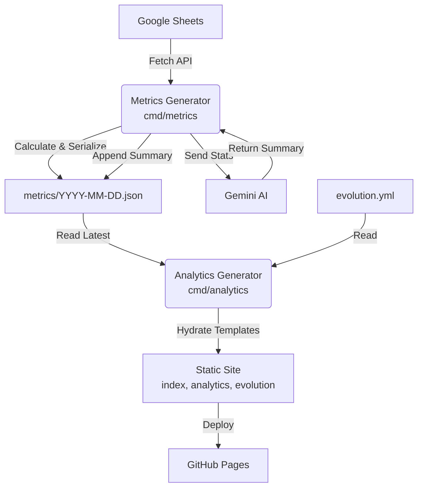
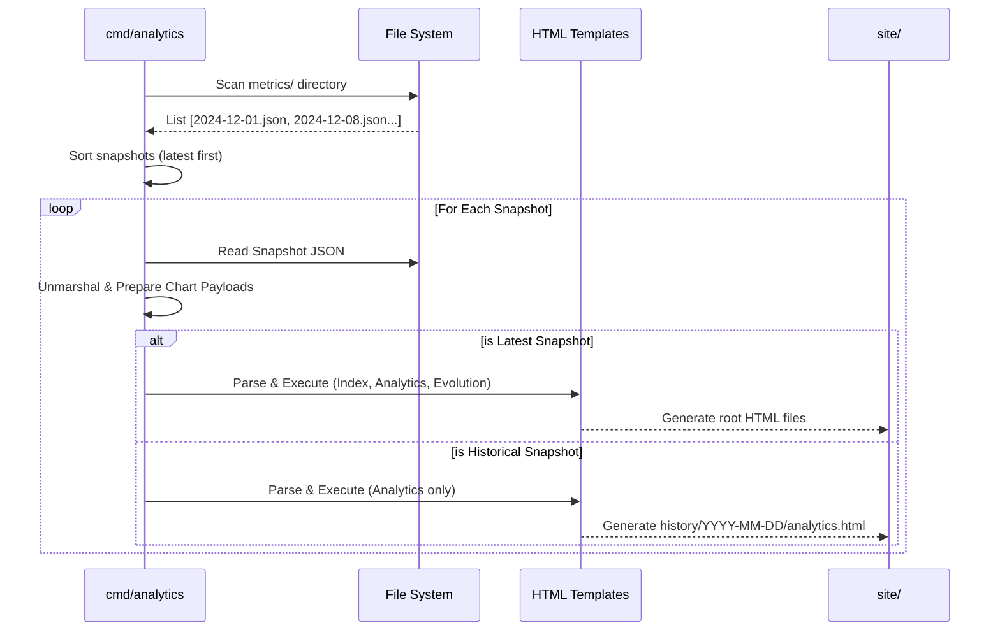

# Analytics Architecture

The analytics layer is a **metrics and visualization pipeline** that processes article data from Google Sheets and generates a multi-page static site. It operates without a persistent backend server, using a build-time generation approach.

## High-Level System Design

## Core Components

### 1. Metrics Generator (`cmd/metrics`)

Fetches raw data from Google Sheets and performs all heavy aggregation logic.

- **Responsibility:** Data sanitization, calculating stats (by year, source, read rates), and serialization.
- **Output:** A timestamped JSON file acting as an immutable snapshot (e.g., `metrics/2025-12-31.json`).

### 2. Analytics Generator (`cmd/analytics`)

Reads archived metrics and evolution data to render the static site.

- **Responsibility:**
  - Identifying **all** metrics JSON files in the `metrics/` folder.
  - Loading project history from `evolution.yml`.
  - Preparing Chart.js payloads.
  - Executing Go HTML templates to generate the current site and historical archives.
- **Key Feature:** Multi-pass generation. It iterates over every snapshot to build a browsable history, while the latest snapshot populates the root dashboard.

### 3. UI & Templates (`cmd/internal/analytics/templates/`)

The source templates used by the Analytics Generator to produce the final site.

- **Logical Structure:**
  - `index.html`: Landing page template with project origin story and design principles.
  - `analytics.html`: Analytics template for reading metrics and interactive charts.
  - `evolution.html`: Timeline template for visualizing technical growth.
  - `base.html`: Shared layout component containing the main structure and navigation.
- **Technology:** Go `html/template`, CSS variables for theming, and Chart.js.
- **Security:** No runtime external API calls; all data is embedded at build time.

### 4. AI Integration (`cmd/internal/ai`)

Manages interactions with the Google Gemini API to perform **AI Delta Analysis**, generating qualitative summaries of changes between metrics snapshots.

- **Responsibility:**
  - Constructing prompts from raw metrics data.
  - Interfacing with the `google.golang.org/genai` SDK.
  - returning a text summary of weekly progress and trends.
- **Analysis Dimensions:** The prompt specifically targets three key metrics:
  1. **Velocity:** Changes in reading pace or read rate.
  2. **Backlog Health:** Balancing clearing old debt (>1 year) vs. adding new unread noise.
  3. **Chronology:** The specific publication years of content focused on during the week.
- **Model:** Defaults to `gemini-2.5-flash-lite` for cost-effective performance.

## Analytics Generation Flow

## References

- **Data Schemas:** See [schemas.md](schemas.md) for the `Metrics` struct and JSON definitions.
- **CI/CD & Deployment:** See [operations.md](operations.md) for the automated weekly workflow.
