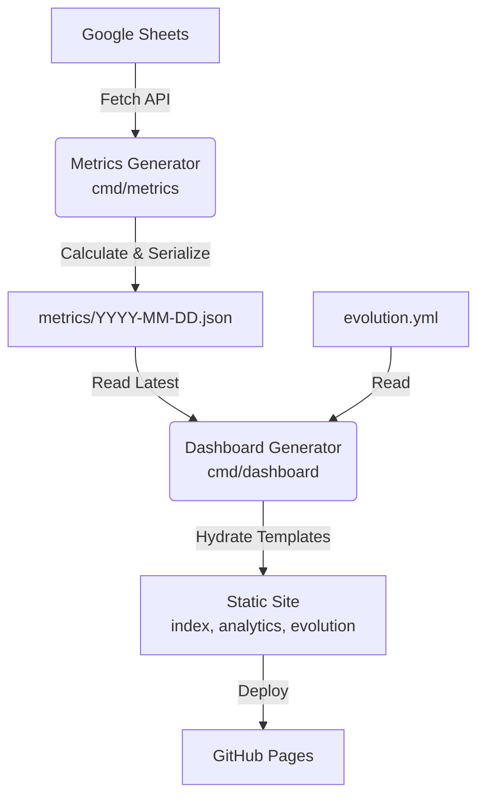
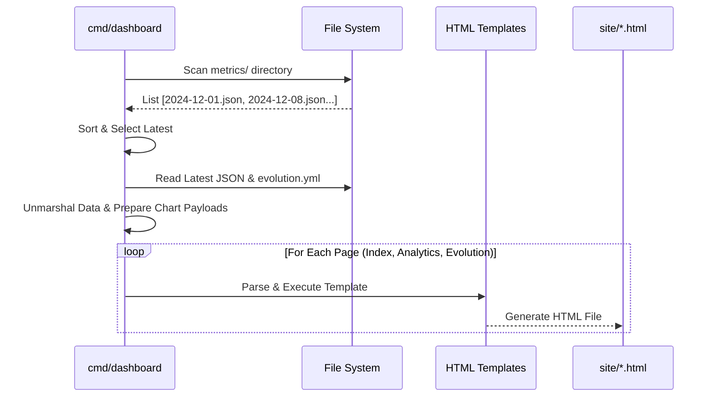

# Dashboard Architecture

The dashboard layer is a **metrics and visualization pipeline** that processes article data from Google Sheets and generates a multi-page static site. It operates without a persistent backend server, using a build-time generation approach.

## High-Level System Design

## Core Components

### 1. Metrics Generator (`cmd/metrics`)

Fetches raw data from Google Sheets and performs all heavy aggregation logic.

- **Responsibility:** Data sanitization, calculating stats (by year, source, read rates), and serialization.
- **Output:** A timestamped JSON file acting as an immutable snapshot (e.g., `metrics/2025-12-31.json`).

### 2. Dashboard Generator (`cmd/dashboard`)

Reads the latest metrics and evolution data to render the static site.

- **Responsibility:**
  - Identifying the latest metrics JSON file.
  - Loading project history from `evolution.yml`.
  - Preparing Chart.js payloads.
  - Executing Go HTML templates to generate specific pages.
- **Key Feature:** It is decoupled from the data source (Google Sheets). It can regenerate the site from archived JSONs offline.

### 3. UI & Templates (`cmd/internal/dashboard/templates/`)

The source templates used by the Dashboard Generator to produce the final site.

- **Logical Structure:**
  - `index.html`: Landing page template with project origin story and design principles.
  - `analytics.html`: Dashboard template for reading metrics and interactive charts.
  - `evolution.html`: Timeline template for visualizing technical growth.
  - `base.html`, `header.html`, `footer.html`: Shared layout components.
- **Technology:** Go `html/template`, CSS variables for theming, and Chart.js.
- **Security:** No runtime external API calls; all data is embedded at build time.

## Dashboard Generation Flow

## References

- **Data Schemas:** See [schemas.md](schemas.md) for the `Metrics` struct and JSON definitions.
- **CI/CD & Deployment:** See [operations.md](operations.md) for the automated weekly workflow.
