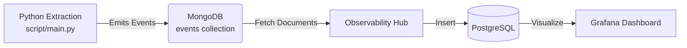

# Observability & Event Architecture

This document outlines the observability layer of the Personal Reading Analytics system. Designed for resilience and auditability, this subsystem decouples the extraction logic from the downstream analytics pipeline, using a structured event log as the source of truth.

## 🏗 System Design

The architecture follows an **Event Sourcing** pattern where every significant action (successful extractions, pipeline summaries, and system failures) is captured as an immutable event.



### Key Architectural Decisions

- **Decoupling via Events:** The extraction service does not write directly to the analytics database. Instead, it emits standardized events to an intermediate store (MongoDB). This allows the analytics schema to evolve independently of the extraction logic.
- **Structured Envelope Schema:** All events share a rigid "Envelope" structure (`timestamp`, `source`, `type`, `payload`), ensuring predictable consumption by downstream processors regardless of the event type.
- **Auditability:** By logging both successes and failures, the system provides a complete audit trail. We can trace exactly when an article was discovered, or identify flakiness in specific provider extractors over time.

---

## 📜 Event Schema Specification

To ensure data integrity across the pipeline, all events adhere to the following contract.

### The Envelope

The top-level structure is strictly typed to facilitate routing and filtering.

| Field | Description |
| :--- | :--- |
| **`timestamp`** | UTC ISO8601 timestamp of when the event occurred. |
| **`source`** | The origin system or provider (e.g., `GitHub`, `Substack`, `System`). |
| **`event_type`** | Discriminator for processing logic (e.g., `extraction`, `error`). |
| **`status`** | Workflow state (`ingested`), signaling readiness for downstream ETL. |
| **`payload`** | **Context-Specific Data:** The domain entity or business logic result. |
| **`meta`** | **Operational Data:** Debugging context, retry counts, or performance metrics. |

---

## 📊 Event Definitions

### Article Extraction Event

Generated when a new content item is successfully identified and parsed. This event drives the core analytics dashboard.

- **Purpose:** Populates the reading list and historical metrics.
- **Key Payload Data:** Article Title, Canonical URL, Publication Date, Domain.

### Pipeline Summary Event

Emitted at the conclusion of every execution cycle (Cron/Scheduled Job).

- **Purpose:** System health monitoring. Allows for "Heartbeat" checks to ensure the pipeline runs even if no new articles are found.
- **Key Payload Data:** Total Articles Processed count.

### Error & Failure Events

Captured automatically when an extractor fails, a network request times out, or a parsing rule breaks.

- **Purpose:** Proactive maintenance. High error rates from a specific source trigger alerts to update the parsing logic (e.g., if a website changes its HTML structure).
- **Key Payload Data:** Error Message, Target URL, Exception Traceback.
- **Key Meta Data:** HTML Snippet (for debugging context), Retry Attempt Count.

### Migration Script

When schema changes occur, use `script/migrations/001_standardize_event_schema.py` (or create a new version) to update legacy documents.

```bash
# Run a dry-run to see proposed changes
.venv/bin/python script/migrations/001_standardize_event_schema.py --dry-run

# Execute the migration
.venv/bin/python script/migrations/001_standardize_event_schema.py
```
