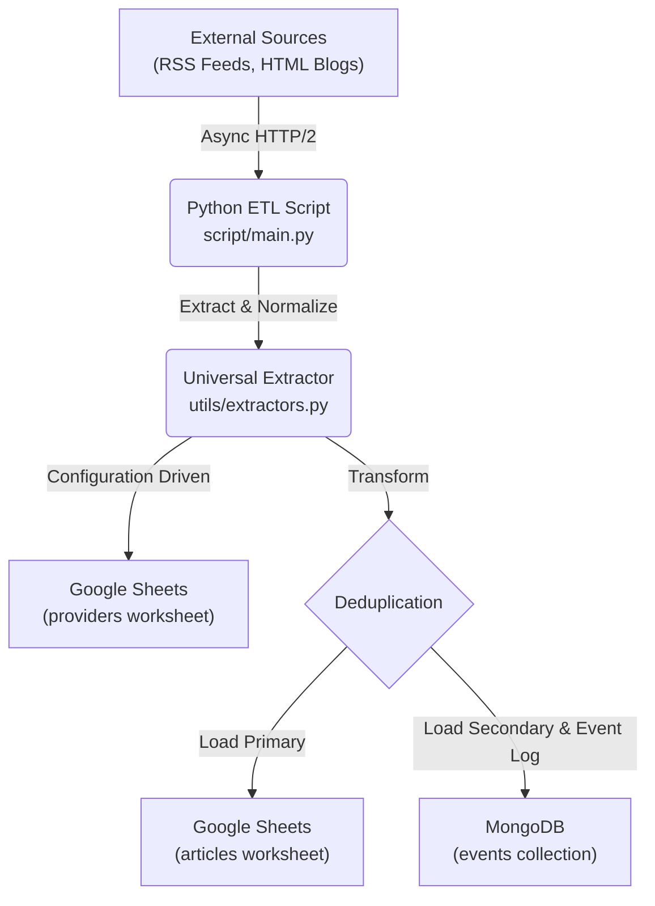
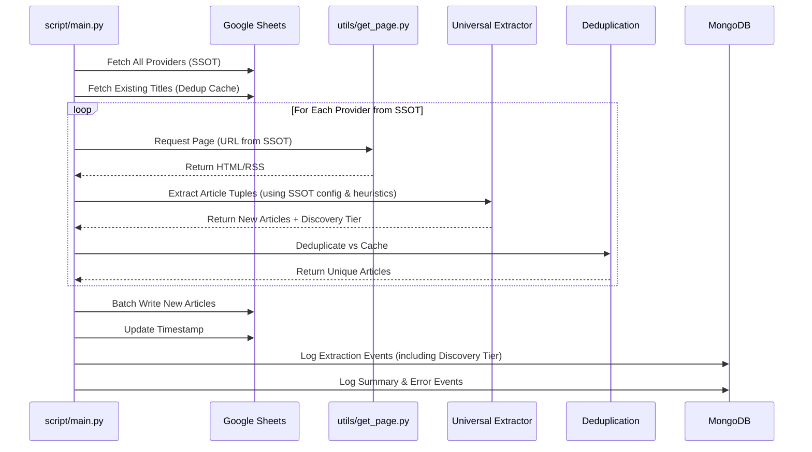

# Extraction Architecture

The extraction layer is an **async web scraping ETL pipeline** that aggregates articles from multiple sources into centralized data stores.

## High-Level System Design

## Core Components

### 1. Orchestration Layer (`script/main.py`)

Coordinates the end-to-end async pipeline.

- **Concurrency:** Uses `asyncio` to manage non-blocking I/O.
- **Lifecycle:** Manages authentication, fetcher state, and final database writes.

### 2. Extraction Layer (`utils/get_page.py`)

Handles network interactions with resilience.

- **Features:** HTTP/2 support, connection pooling, and stateful rate-limiting (1s intervals).
- **Safety:** Graceful degradation on timeouts or non-200 responses.

### 3. Universal Extractor (`utils/extractors.py`)

The core of the "Zero-Code" onboarding. This component performs configuration-driven, heuristic-based extraction.

- **Metadata-Driven Governance:** Reads site-specific selectors, strategies (RSS, HTML, Substack), and other extraction parameters directly from the Google Sheets `providers` worksheet (the SSOT).
- **Heuristic Extraction:** Employs a "Link-First" strategy for title detection and a 5-tier discovery strategy for publication dates, making it resilient to minor DOM changes.
- **Dynamic Normalization:** Standardizes dates to ISO 8601 and dynamically maps/capitalizes source names based on live SSOT metadata, replacing static Go maps.
- **Operational Hardening:** Captures "Discovery Tier" metadata in MongoDB to audit heuristic performance in production.

### 4. Load Layer (`utils/sheet.py` & `mongo.py`)

Dual-write strategy for data redundancy.

- **Primary:** Batch writes to Google Sheets for the dashboard.
- **Secondary:** Optional batch writes to MongoDB for structured querying.

## Extraction Sequence

## References

- **Data Schemas:** See [schemas.md](schemas.md) for Article tuples and MongoDB document definitions.
- **Automation:** See [operations.md](operations.md) for the daily extraction schedule.
