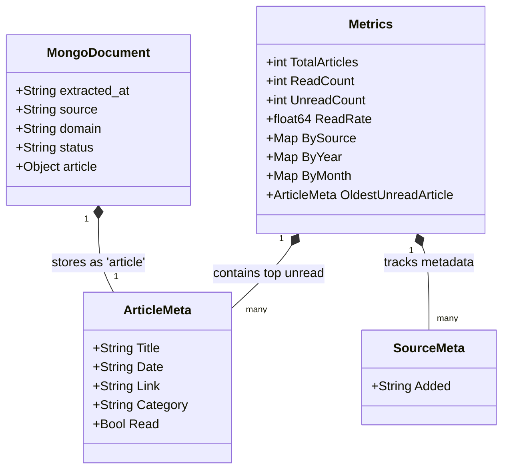

# Data Schemas & Models

This document defines the core data structures used across the extraction and dashboard pipelines, serving as the single source of truth for data contracts.

## 1. Domain Model Overview



## 2. Go Metrics Schema

The `Metrics` struct is the JSON contract between the **Metrics Generator** (`cmd/metrics`) and the **Analytics Generator** (`cmd/analytics`). Defined in `cmd/internal/schema.go`.

```go
type Metrics struct {
    TotalArticles                int                          `json:"total_articles"`
    BySource                     map[string]int               `json:"by_source"`
    BySourceReadStatus           map[string][2]int            `json:"by_source_read_status"`
    ByYear                       map[string]int               `json:"by_year"`
    ByMonth                      map[string]int               `json:"by_month"`
    ByYearAndMonth               map[string]map[string]int    `json:"by_year_and_month"`
    ByMonthAndSource             map[string]map[string][2]int `json:"by_month_and_source_read_status"`
    ByCategory                   map[string][2]int            `json:"by_category"`
    ByCategoryAndSource          map[string]map[string][2]int `json:"by_category_and_source"`
    ReadUnreadTotals             [2]int                       `json:"read_unread_totals"`
    UnreadByMonth                map[string]int               `json:"unread_by_month"`
    UnreadByCategory             map[string]int               `json:"unread_by_category"`
    UnreadBySource               map[string]int               `json:"unread_by_source"`
    UnreadByYear                 map[string]int               `json:"unread_by_year"`
    UnreadArticleAgeDistribution map[string]int               `json:"unread_article_age_distribution"`
    OldestUnreadArticle          *ArticleMeta                 `json:"oldest_unread_article,omitempty"`
    TopOldestUnreadArticles      []ArticleMeta                `json:"top_oldest_unread_articles,omitempty"`
    SourceMetadata               map[string]SourceMeta        `json:"source_metadata"`
    ReadCount                    int                          `json:"read_count"`
    UnreadCount                  int                          `json:"unread_count"`
    ReadRate                     float64                      `json:"read_rate"`
    AvgArticlesPerMonth          float64                      `json:"avg_articles_per_month"`
    LastUpdated                  time.Time                    `json:"last_updated"`
    AISummary                    string                       `json:"ai_summary,omitempty"`
}

type ArticleMeta struct {
    Title    string `json:"title"`
    Date     string `json:"date"`
    Link     string `json:"link"`
    Category string `json:"category"`
    Read     bool   `json:"read"`
}
```

## 3. Extraction Pipeline Schemas

### Article Tuple (Python Internal)

Used internally during the Python extraction pipeline (ETL) before loading.
Format: `(date, title, link, source)`

### MongoDB Document

Structure used for archival and event logging in MongoDB.

```json
{
  "extracted_at": "2025-12-22T10:30:00Z",
  "source": "freecodecamp",
  "article": {
    "title": "Understanding Async Python",
    "link": "https://www.freecodecamp.org/news/async-python",
    "published_date": "2025-01-15"
  },
  "domain": "freecodecamp.org",
  "status": "ingested"
}
```

## 4. Evolution Schema

The `EvolutionData` struct defines the structure for `evolution.yml`, which powers the **Evolution Page**. Defined in `cmd/internal/schema.go`.

```go
type EvolutionData struct {
    Events []Milestone `yaml:"events"`
}

type Milestone struct {
    Date             string   `yaml:"date"`
    Title            string   `yaml:"title"`
    Description      string   `yaml:"description"` // Raw multiline string from YAML
    DescriptionLines []string `yaml:"-"`           // Parsed into a slice for templates
}
```
