# Architecture Guide

This document outlines the structure, components, and data flow of the articles-extractor data pipeline.

## Overview

articles-extractor is a **serverless ETL (Extract, Transform, Load) data pipeline** that orchestrates automated article extraction from multiple sources and aggregates them into a centralized Google Sheet. Built on **GitHub Actions for scheduling data extraction** and **Jenkins for CI/CD Docker image publishing**, the architecture showcases modern DataOps patterns: source aggregation, data transformation, deduplication, reproducible builds, and infrastructure-as-code—all without requiring dedicated infrastructure. The dual automation approach separates concerns: GitHub Actions handles scheduled data workflows (serverless), while Jenkins automates Docker image builds and publishing to GHCR. It's designed to run on a schedule, support extensible provider configuration, and enable containerized deployments.

## High-Level Data Flow (ETL Pipeline)

```mermaid
graph TD
    A["📰 Article Sources"] --> B["freeCodeCamp<br/>GitHub Blog<br/>Shopify<br/>Substack"]
    B -->|Extract: HTTP Requests| C["🌐 Web Scraper Module<br/>Beautiful Soup + httpx"]
    C -->|Transform: Parse HTML| D["🔍 Article Extractors<br/>Provider-specific parsers"]
    D -->|Transform: Deduplicate| E["☁️ Google Sheets API<br/>Load & Aggregate"]
    E -->|Load| F["📊 Centralized Data Store<br/>articles + providers"]
    F -->|Read| D
```



**ETL Pipeline Stages:**

1. **Extract**: Fetch web pages from configured provider URLs via HTTP requests
2. **Transform**: Parse HTML using Beautiful Soup and extract structured article data
3. **Transform**: Deduplicate against existing titles for data quality
4. **Load**: Append new articles to Google Sheet and maintain metadata
5. **Finalize**: Sort and timestamp the aggregated dataset

## Project Setup & Configuration

### Project Structure

```plaintext
articles-extractor/
├── main.py                 # Entry point & orchestration
├── utils/                  # Core utility modules
│   ├── __init__.py        # Package exports
│   ├── sheet.py           # Google Sheets API interactions
│   ├── get_page.py        # Web fetching & HTTP client
│   ├── extractors.py      # Provider-specific article parsers
│   ├── format_date.py     # Date/time utilities
│   └── constants.py       # Configuration constants
├── .github/workflows/
│   └── scheduled_extraction.yml  # GitHub Actions workflow
├── Jenkinsfile             # Jenkins CI/CD pipeline definition
├── Dockerfile              # Docker container setup
├── docker-compose.yml      # Local development & deployment
├── Makefile                # Development & deployment commands
├── requirements.txt        # Python dependencies
├── credentials.json        # Google API credentials (gitignored)
└── docs/                   # Documentation
    ├── architecture.md     # This file - system design & data flow
    ├── github_actions.md   # GitHub Actions workflow automation
    └── jenkins.md          # Jenkins CI/CD pipeline setup
```

### Dependencies

#### External Libraries

- **gspread** - Google Sheets API client
- **google-auth** - Google authentication
- **beautifulsoup4** - HTML parsing
- **httpx** - Async HTTP client

#### Google APIs

- **Google Sheets API** - Store and retrieve data
- **Google OAuth 2.0** - Authentication

### Configuration

#### Environment Variables

- `SHEET_ID` - Google Sheet ID (required)
- `CREDENTIALS` - JSON credentials file (required for auth)

#### Rate Limiting

Configured in `utils/constants.py`:

- Request interval between calls: 1.0 second
- HTTP timeout: 30 seconds

## Core Components (Pipeline Stages)

### 1. **Orchestration Layer** (`main.py`)

Coordinates the ETL pipeline end-to-end: initialization, provider fetching, deduplication setup, and data flow orchestration. Demonstrates generator-based streaming to process articles immediately after extraction rather than batch processing.

### 2. **Extraction Layer** (`utils/get_page.py`)

Handles HTTP data extraction with rate limiting (1 second between requests, 30-second timeout) and connection management. Implements respectful web scraping practices and resilience patterns.

### 3. **Transform Layer** (`utils/extractors.py`)

Provider-specific HTML parsers that extract structured article data (date, title, URL). Each extractor is modular and independent, supporting extensibility for new providers. Includes error handling and data validation.

### 4. **Transform Layer: Deduplication** (`utils/sheet.py` - read phase)

Retrieves existing article titles from Google Sheet for deduplication logic. Ensures data quality and prevents duplicate entries in the aggregated dataset.

### 5. **Load Layer** (`utils/sheet.py`)

Handles Google Sheets API interactions: OAuth authentication, data insertion, metadata updates, and sheet maintenance. Acts as the lightweight backend storage.

### 6. **Utilities** (`utils/format_date.py`, `utils/constants.py`)

Shared utilities for date transformation and configuration management used across all pipeline stages.

## Data Models (Schema)


**Provider Schema** (Configuration - `providers` worksheet):

- `name`: Provider identifier (e.g., "freecodecamp", "github") - Used for logging and tracking
- `element`: CSS selector for article elements on the page - Enables provider-specific parsing
- `url`: Source website URL - Extraction endpoint

**Article Schema** (Aggregated Data - `articles` worksheet):

- `date`: Publication date (YYYY-MM-DD format) - Used for sorting and chronological ordering
- `title`: Article headline - Deduplication key
- `link`: Full URL to the article - Navigation/reference
- `source`: Provider name (foreign key to providers) - Data lineage tracking

The schema demonstrates data lineage and source attribution, key principles in data pipeline design.

## Processing Flow (Pipeline Execution)

```mermaid
flowchart TD
    Start["🚀 Start"]
    Init["Initialize<br/>Setup logging & auth"]
    GetProviders["Read Configuration<br/>Fetch Providers from Sheet"]
    GetTitles["Load Dedup Cache<br/>Get Existing Titles"]
    
    Start --> Init --> GetProviders --> GetTitles
    
    Process["Process Each Provider"]
    Skip["⏭️ Skip Duplicate"]
    Fetch["Extract: Fetch Webpage"]
    Parse["Transform: Parse HTML<br/>Beautiful Soup"]
    Extract["Transform: Extract Articles<br/>Provider-specific parser"]
    CheckDup{"Deduplicate<br/>check?"}
    Append["Load: Append to<br/>Google Sheet"]
    
    GetTitles --> Process
    Skip --> Process
    Process --> Fetch --> Parse --> Extract --> CheckDup
    CheckDup -->|Yes| Skip
    CheckDup -->|No| Append --> Process
    
    AllDone["All providers<br/>processed?"]
    Sort["Finalize: Sort Articles<br/>by date"]
    Update["Finalize: Update Timestamp"]
    Log["Finalize: Log Results"]
    Complete["✅ Pipeline Complete"]
    
    Process -->|Yes| AllDone --> Sort --> Update --> Log --> Complete
```



**Pipeline Guarantees:**

- **At-least-once delivery**: Failed batches are logged; rerunning the pipeline is safe
- **Deduplication idempotency**: Duplicate check prevents reruns from creating duplicates
- **Data consistency**: All articles are sorted after load; metadata is timestamped
- **Fault isolation**: Provider errors don't halt other providers

## Error Handling & Resilience

The pipeline implements **fault-tolerant design** common in production data systems:

1. **Provider-level fault isolation** - Individual provider failures don't cascade; pipeline continues processing other providers
2. **Extraction error boundaries** - Caught by `@extractor_error_handler` decorator; malformed data is logged but doesn't block the pipeline
3. **Network resilience** - httpx timeout management (30 second timeout) prevents hanging; timeouts are logged as provider failures
4. **API error handling** - Google Sheets API errors are logged with full context; transient failures can be retried by re-running the pipeline

**Idempotent Operations**:

- Deduplication check ensures reruns don't insert duplicates
- Timestamp updates are overwritten (safe for retries)
- Sheet sorting is deterministic

All errors are written to stdout for operational visibility (captured in GitHub Actions logs or Docker containers).

## Logging & Observability

Structured logging enables operational visibility:

- **Level**: INFO (production-grade)
- **Format**: `%(asctime)s - %(name)s - %(levelname)s - %(message)s`
- **Output**: stdout (captured by GitHub Actions logs and Docker)

**Key Log Messages** (Observable Events):

- "Processed {provider}: X new articles found" - Success metric
- "Failed to fetch page for {provider}" - Network issue indicator
- "Error processing {provider}: {error}" - Provider-specific failures
- "Unknown provider: {provider}" - Configuration issue

These logs enable downstream monitoring, alerting, and audit trails—essential for operational pipelines.

## Performance & Serverless Architecture

### Execution Model

- **Sequential processing** - Providers processed one at a time; can be parallelized if needed
- **Generator-based streaming** - Articles flow through pipeline immediately after extraction (no batch buffering)
- **Memory efficient** - Generators enable incremental processing without storing all articles in memory

### Rate Limiting & Respect

- **Request interval**: 1.0 second between HTTP requests - Respectful crawling, reduced server load
- **HTTP timeout**: 30 seconds - Prevents hanging on slow/unresponsive sites

### Data Quality

- **Deduplication**: Articles checked against existing titles before insertion - Prevents dataset pollution
- **Sorting**: Articles sorted by date after load - Maintains temporal ordering

### Serverless Benefits (GitHub Actions)

- **Zero infrastructure overhead** - No servers to maintain or monitor
- **Cost efficiency** - Pay only for execution time (GitHub Actions included in free tier for public repos)
- **Automatic scheduling** - GitHub Actions handles cron scheduling natively
- **Built-in observability** - Logs stored in GitHub; integrates with GitHub Issues for alerting
- **No deployment complexity** - Code and workflow configuration live in the repository

### Scalability Path

- Current design supports adding providers via configuration (no code changes needed)
- Generator architecture allows processing very large datasets without memory concerns
- Multi-provider parallelization can be enabled by using async/await patterns or scheduled concurrency

## Deployment & Automation

The project uses a **dual automation approach** for data extraction and image publishing:

### GitHub Actions: Scheduled Data Extraction

GitHub Actions runs the data extraction pipeline on a schedule (default: daily at 6:00 AM UTC):

- **Serverless execution**: No infrastructure to maintain
- **Scheduled runs**: Cron-based automation (configurable)
- **Built-in logging**: Logs stored in GitHub for review and debugging
- **Cost-efficient**: Included in free tier for public repositories

See [`GitHub Actions`](github_actions.md) for workflow details and configuration.

### Jenkins: Docker Image Building & Publishing

Jenkins (typically self-hosted via Docker Compose) automates Docker image builds and publishes to GHCR:

- **Reproducible builds**: Versioned Docker images (tagged by build number + `latest`)
- **SCM polling**: Checks for code changes on a schedule (default: every Tuesday)
- **CI/CD automation**: Decouples image builds from data extraction workflows
- **Self-hosted flexibility**: Can be run on any machine with Docker

See [`Jenkins`](jenkins.md) for pipeline configuration and setup.

### Architecture Summary

- **Data extraction** (GitHub Actions) → automated article collection and Google Sheets updates
- **Docker image publishing** (Jenkins) → reproducible, versioned container images for deployment
- Together, these provide a complete automated, production-grade data pipeline with containerized deployment options
