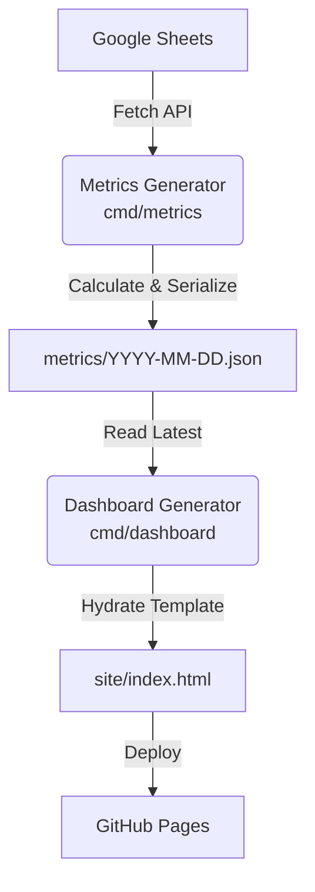
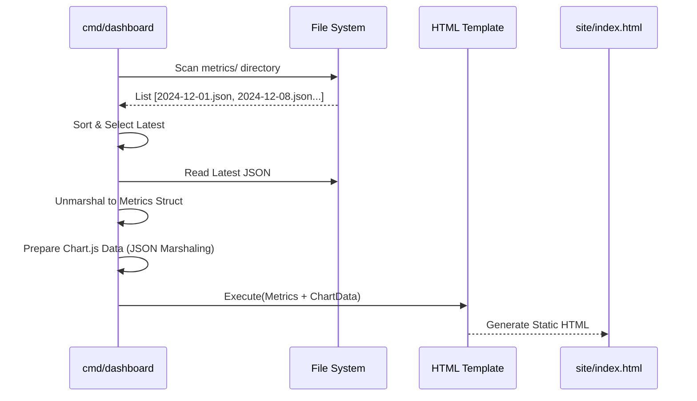

# Dashboard Architecture

The dashboard layer is a **metrics and visualization pipeline** that processes article data from Google Sheets and generates an interactive HTML dashboard. It operates without a persistent backend server, using a build-time generation approach.

## High-Level System Design

## Core Components

### 1. Metrics Generator (`cmd/metrics`)

Fetches raw data from Google Sheets and performs all heavy aggregation logic.

- **Responsibility:** Data sanitization, calculating stats (by year, source, read rates), and serialization.
- **Output:** A timestamped JSON file acting as an immutable snapshot (e.g., `metrics/2025-12-31.json`).

### 2. Dashboard Generator (`cmd/dashboard`)

Reads the latest metrics and renders the visualization.

- **Responsibility:** Determining the latest data file, preparing Chart.js payloads, and executing the Go HTML template.
- **Key Feature:** It is decoupled from the data source (Google Sheets). It can regenerate the dashboard from archived JSONs offline.

### 3. Visualization Layer (`site/index.html`)

A standalone HTML5 single-page dashboard.

- **Technology:** Go `html/template`, CSS Grid, and Chart.js.
- **Design:** Responsive, dark-themed metric cards, and interactive charts.
- **Security:** No runtime external API calls; all data is embedded at build time.

## Dashboard Generation Flow

## References

- **Data Schemas:** See [schemas.md](schemas.md) for the `Metrics` struct and JSON definitions.
- **CI/CD & Deployment:** See [operations.md](operations.md) for the automated weekly workflow.
