# Dashboard Architecture

This document outlines the structure, components, and data flow of the dashboard generation pipeline.

## Overview

The dashboard layer is a **metrics and visualization pipeline** that processes article data from Google Sheets and generates an interactive HTML dashboard. Built with **Go for efficient metrics calculation** and **Chart.js for interactive visualization**, the architecture showcases modern data visualization patterns: metrics aggregation, JSON serialization, and responsive HTML generation—all without requiring a backend server. The dual-step approach separates concerns: metrics generation runs weekly to calculate statistics from Google Sheets, and dashboard generation runs on a schedule to produce HTML from the latest metrics.

## High-Level Data Flow (Metrics & Dashboard Pipeline)

```mermaid
graph TD
    A["📊 Google Sheets"] -->|Fetch Articles| B["🔢 Metrics Generator<br/>cmd/metrics"]
    B -->|Calculate Stats| C["📈 Metrics JSON<br/>metrics/YYYY-MM-DD.json"]
    C -->|Read Latest| D["🎨 Dashboard Generator<br/>cmd/dashboard"]
    D -->|Generate HTML| E["📄 Dashboard HTML<br/>site/index.html"]
    E -->|Deploy| F["🌐 GitHub Pages<br/>Live Dashboard"]
```



**Pipeline Stages:**

1. **Metrics Generation**: Fetch articles from Google Sheets API
2. **Calculate**: Aggregate metrics (total, by source, by time period, read rates)
3. **Serialize**: Save metrics as JSON with timestamp
4. **Dashboard Generation**: Read latest metrics JSON
5. **Visualize**: Generate interactive HTML with Chart.js
6. **Deploy**: Publish to GitHub Pages

## Project Setup & Configuration

### Project Structure

```plaintext
personal-reading-analytics-dashboard/
├── cmd/
│   ├── internal/                  # Shared Go code for metrics/dashboard
│   │   ├── schema.go              # Data schema definitions
│   │   ├── metrics/               # Metrics calculation logic
│   │   │   ├── metrics.go
│   │   │   └── metrics_test.go
│   │   └── dashboard/             # Dashboard rendering logic
│   │       ├── charts.go
│   │       ├── chart_test.go
│   │       ├── loader.go
│   │       ├── loader_test.go
│   │       └── template.html
│   ├── metrics/                   # Metrics generator (Google Sheets → JSON)
│   │   └── main.go
│   └── dashboard/                 # Dashboard generator (JSON → HTML)
│       └── main.go
├── metrics/                       # Metrics JSON archive (YYYY-MM-DD.json)
├── site/                          # Generated dashboard HTML (index.html)
├── .github/workflows/
│   ├── generate-metrics.yml       # Metrics generation workflow
│   └── deploy_pages.yml           # Dashboard deployment workflow
├── go.mod                         # Go module definition
├── go.sum                         # Go dependencies lock
├── Makefile                       # Build and dev commands
└── docs/                          # Documentation (dashboard_architecture.md, etc.)
```

### Dependencies

#### Go Packages

- **google.golang.org/api/sheets/v4** - Google Sheets API client
- **google.golang.org/api/option** - Google API options
- **google.golang.org/api/auth/oauth2** - OAuth2 authentication
- **golang.org/x/oauth2/google** - Google OAuth2 provider
- **html/template** - HTML template engine

#### Google APIs

- **Google Sheets API v4** - Fetch article data
- **Google OAuth 2.0** - Authentication

### Configuration

#### Environment Variables

- `SHEET_ID` - Google Sheet ID (required for metrics generator)
- `CREDENTIALS` - JSON credentials file path (required for metrics generator)

#### Command-Line Binaries

- `metricsjson` - Metrics generator binary (built from `cmd/metrics`)
- `dashboard` - Dashboard generator binary (built from `cmd/dashboard`)

## Core Components (Pipeline Stages)

### 1. **Metrics Generator** (`cmd/metrics/main.go` + `cmd/internal/metrics/metrics.go`)

Fetches article data from Google Sheets API and calculates comprehensive metrics across multiple dimensions:

**Core Metrics:**
- **Total articles**: Count of all articles in the dataset (`total_articles`)
- **Read/unread statistics**: Read count, unread count, read rate percentage, and totals array (`read_count`, `unread_count`, `read_rate`, `read_unread_totals`)

**Source-Level Metrics:**
- **By source**: Article count per provider (`by_source`)
- **By source read status**: Read/unread split per provider with [read, unread] pairs (`by_source_read_status`)
- **Substack author count**: Special tracking for Substack provider count (`substack_author_count` within `by_source_read_status`)
- **Source metadata**: Addition date for each source (`source_metadata` with `added` field)

**Time-Based Metrics:**
- **By year**: Articles grouped by publication year (`by_year`)
- **By month**: Articles grouped by month (01-12) (`by_month`)
- **By year and month**: Nested aggregation of articles by year then month (`by_year_and_month`)
- **By month and source**: Monthly distribution per provider with read/unread status [read, unread] pairs (`by_month_and_source`)

**Category Metrics:**
- **By category**: Article counts with read/unread status per category (`by_category`)
- **By category and source**: Nested aggregation with read/unread status (`by_category_and_source`)

**Unread Article Tracking:**
- **Unread by month**: Unread article counts per month (`unread_by_month`)
- **Unread by year**: Unread article counts per year (`unread_by_year`)
- **Unread by category**: Unread counts per category (`unread_by_category`)
- **Unread by source**: Unread counts per source (`unread_by_source`)
- **Oldest unread article**: Details of the oldest unread article with title, date, link, category, and read status (`oldest_unread_article`)
- **Top oldest unread articles**: Array of top 3 oldest unread articles (`top_oldest_unread_articles`)

**Calculated Metrics:**
- **Average articles per month**: Based on actual data span from earliest to latest article date (`avg_articles_per_month`)
- **Timestamp**: Last updated timestamp in ISO 8601 format (`last_updated`)

**Implementation Details:**
- Core calculation logic in `cmd/internal/metrics/metrics.go`
- Orchestration and Google Sheets integration in `cmd/metrics/main.go`
- Supports sheet name auto-discovery (finds "Articles" and "Providers" sheets)
- Gracefully handles incomplete rows and invalid dates
- Saves metrics as JSON to `metrics/YYYY-MM-DD.json` for archival and historical tracking

### 2. **Dashboard Generator** (`cmd/dashboard/main.go` + `cmd/internal/dashboard/`)

Reads the latest metrics JSON from the `metrics/` folder and generates an interactive HTML dashboard with comprehensive visualizations.

**Implementation Components:**
- `cmd/dashboard/main.go`: Main orchestration and template data preparation
- `cmd/internal/dashboard/loader.go`: Template file loading with multiple path fallback strategies
- `cmd/internal/dashboard/charts.go`: Chart.js data preparation for year and month visualizations
- `cmd/internal/dashboard/template.html`: HTML template with embedded CSS and JavaScript

**Key Metrics Section:**
- Total articles count with formatted display
- Read rate percentage with visual highlighting
- Read articles count with color-coded styling
- Unread articles count
- Average articles per month (calculated from actual data span)
- Top read rate source (highest percentage)
- Most unread source (highest unread count)
- This month's read articles (current month only)

**Sources Section:**
- Individual source cards for each provider (Substack, freeCodeCamp, GitHub, Shopify, Stripe)
- Per-source statistics: total count, read/unread split, read percentage
- Source metadata display showing when each source was added
- Special Substack calculation: per-author average (total articles ÷ author count)
- Color-coded cards matching Chart.js visualization colors

**Visualizations (Chart.js):**

1. **Year Breakdown Chart**: 
   - Bar chart showing total articles by publication year
   - Descending year order (latest first)
   - Color gradient per year
   
2. **Read/Unread by Year Chart**:
   - Stacked bar chart with read (green) and unread (red) articles per year
   - Shows reading progress across years
   
3. **Monthly Breakdown Chart**: 
   - Interactive toggle between two views:
     - **Total Articles**: Line chart showing monthly trends (Jan-Dec, all years aggregated)
     - **By Source**: Stacked bar chart showing monthly distribution per provider
   - Month aggregation across all years for trend analysis
   
4. **Read/Unread by Month Chart**:
   - Stacked bar chart with read and unread articles per month
   - Shows seasonal reading patterns
   
5. **Read/Unread by Source Chart**:
   - Horizontal stacked bar chart per provider
   - Visual comparison of reading progress across sources
   
6. **Unread Articles by Age Distribution**:
   - Bar chart showing unread article age buckets:
     - Less than 1 month
     - 1-3 months
     - 3-6 months
     - 6-12 months
     - Older than 1 year
   - Helps prioritize reading backlog
   
7. **Unread Articles by Year**:
   - Bar chart showing unread articles by publication year
   - Identifies which years have the most unread content

**Oldest Unread Articles Section:**
- Displays top 3 oldest unread articles with:
  - Title (clickable link)
  - Publication date
  - Source/category
  - Age calculation in days
- Special highlight for the oldest unread article

**Design Features:**
- Semantic HTML5 with proper accessibility (aria-labels, semantic tags)
- Responsive CSS Grid layout (works on desktop, tablet, and mobile)
- Blue gradient background (#4facfe → #00f2fe)
- Dark blue metric cards with borders and shadows
- Interactive Chart.js visualizations with hover tooltips
- Color-coded sources consistent across all visualizations
- Performance optimized with embedded CSS and JavaScript (no external dependencies)
- Template-driven rendering using Go's `html/template` for XSS safety

### 3. **Data Serialization Layer**

The metrics JSON structure serves as the **single source of truth** for dashboard rendering, containing comprehensive analytics calculated from Google Sheets data. Generated by `cmd/metrics/main.go` and saved to `metrics/YYYY-MM-DD.json`.

**Go Schema Definition** (`cmd/internal/schema.go`):

```go
type Metrics struct {
    TotalArticles                int                          `json:"total_articles"`
    BySource                     map[string]int               `json:"by_source"`
    BySourceReadStatus           map[string][2]int            `json:"by_source_read_status"`
    ByYear                       map[string]int               `json:"by_year"`
    ByMonth                      map[string]int               `json:"by_month"`
    ByYearAndMonth               map[string]map[string]int    `json:"by_year_and_month"`
    ByMonthAndSource             map[string]map[string][2]int `json:"by_month_and_source_read_status"`
    ByCategory                   map[string][2]int            `json:"by_category"`
    ByCategoryAndSource          map[string]map[string][2]int `json:"by_category_and_source"`
    ReadUnreadTotals             [2]int                       `json:"read_unread_totals"`
    UnreadByMonth                map[string]int               `json:"unread_by_month"`
    UnreadByCategory             map[string]int               `json:"unread_by_category"`
    UnreadBySource               map[string]int               `json:"unread_by_source"`
    UnreadByYear                 map[string]int               `json:"unread_by_year"`
    UnreadArticleAgeDistribution map[string]int               `json:"unread_article_age_distribution"`
    OldestUnreadArticle          *ArticleMeta                 `json:"oldest_unread_article,omitempty"`
    TopOldestUnreadArticles      []ArticleMeta                `json:"top_oldest_unread_articles,omitempty"`
    SourceMetadata               map[string]SourceMeta        `json:"source_metadata"`
    ReadCount                    int                          `json:"read_count"`
    UnreadCount                  int                          `json:"unread_count"`
    ReadRate                     float64                      `json:"read_rate"`
    AvgArticlesPerMonth          float64                      `json:"avg_articles_per_month"`
    LastUpdated                  time.Time                    `json:"last_updated"`
}

type ArticleMeta struct {
    Title    string `json:"title"`
    Date     string `json:"date"`
    Link     string `json:"link"`
    Category string `json:"category"`
    Read     bool   `json:"read"`
}

type SourceMeta struct {
    Added string `json:"added"`
}
```

**Field Descriptions:**

| Field | Type | Description |
|-------|------|-------------|
| `total_articles` | int | Total count of all articles |
| `by_source` | map[string]int | Article count per provider (GitHub, Shopify, Stripe, Substack, freeCodeCamp) |
| `by_source_read_status` | map[string][2]int | Read/unread split per provider as `[read, unread]` pairs. Includes special `substack_author_count` for per-author metrics |
| `by_year` | map[string]int | Article count grouped by publication year (2011-2025) |
| `by_month` | map[string]int | Article count grouped by month (01-12), aggregated across all years |
| `by_year_and_month` | map[string]map[string]int | Nested year → month → count structure for historical tracking |
| `by_month_and_source_read_status` | map[string]map[string][2]int | Month → source → `[read, unread]` pairs for monthly distribution per provider |
| `by_category` | map[string][2]int | Category → `[read, unread]` pairs (currently mirrors sources) |
| `by_category_and_source` | map[string]map[string][2]int | Nested category → source → `[read, unread]` structure (currently empty) |
| `read_unread_totals` | [2]int | Global read/unread totals as `[read, unread]` pair |
| `unread_by_month` | map[string]int | Unread article count per month (01-12) |
| `unread_by_category` | map[string]int | Unread article count per category |
| `unread_by_source` | map[string]int | Unread article count per provider |
| `unread_by_year` | map[string]int | Unread article count per year |
| `unread_article_age_distribution` | map[string]int | Age buckets: `<1 month`, `1-3 months`, `3-6 months`, `6-12 months`, `>1 year` |
| `oldest_unread_article` | ArticleMeta | Details of the single oldest unread article (title, date, link, category) |
| `top_oldest_unread_articles` | []ArticleMeta | Array of top 3 oldest unread articles |
| `source_metadata` | map[string]SourceMeta | When each source was added to the system (ISO date or "initial") |
| `read_count` | int | Total read articles count |
| `unread_count` | int | Total unread articles count |
| `read_rate` | float64 | Percentage of articles read (read_count ÷ total_articles × 100) |
| `avg_articles_per_month` | float64 | Average articles per month based on actual data span (earliest to latest article date) |
| `last_updated` | string (ISO 8601) | Timestamp when metrics were generated (RFC3339 format with nanoseconds) |

**Design Principles:**

- **Array pairs for status**: `[read, unread]` format consistently used for read/unread splits (index 0 = read, index 1 = unread)
- **String keys for time periods**: Years and months stored as strings ("2024", "01") to preserve leading zeros and enable lexicographic sorting
- **Nested maps for multi-dimensional data**: `by_year_and_month` and `by_month_and_source_read_status` use nested structures for complex queries
- **Omitempty for optional fields**: `oldest_unread_article` and `top_oldest_unread_articles` omitted when no unread articles exist
- **Metadata tracking**: `source_metadata` records when sources were added for historical context
- **Calculated fields**: `avg_articles_per_month` computed from actual date range, not calendar assumptions
- **Type safety**: Go structs with JSON tags ensure consistent serialization and type validation

### 4. **HTML Template Engine** (`cmd/dashboard/main.go` + `cmd/internal/dashboard/template.html`)

The dashboard generator uses **Go's `html/template` package** to transform metrics JSON into an interactive, self-contained HTML dashboard with embedded CSS and Chart.js visualizations.

**Template Processing Pipeline:**

1. **Load Template**: `LoadTemplateContent()` reads `template.html` with fallback path strategies
2. **Prepare Data**: `generateHTMLDashboard()` transforms metrics into template variables
3. **Chart Data Preparation**: Helper functions serialize JSON data for Chart.js
4. **Template Execution**: Go's template engine renders HTML with type-safe variable substitution
5. **File Write**: Generated HTML written to `site/index.html` (atomic operation)

**Template Data Structure** (passed to template execution):

```go
data := map[string]interface{}{
    "DashboardTitle":                   "📚 Personal Reading Analytics",
    "KeyMetrics":                       []KeyMetric{...},          // 5 metrics
    "highlightMetrics":                 []HightlightMetric{...},   // 3 badges
    "TotalArticles":                    int,
    "ReadCount":                        int,
    "UnreadCount":                      int,
    "ReadRate":                         float64,
    "AvgArticlesPerMonth":              float64,
    "LastUpdated":                      time.Time,
    "Sources":                          []SourceInfo{...},         // Per-source stats
    "Months":                           []MonthInfo{...},          // Monthly aggregated data
    "Years":                            []YearInfo{...},           // Yearly data
    "AllYears":                         []string,                  // Year filter list
    "AllSources":                       []string,                  // Source filter list
    "YearChartLabels":                  template.JS,               // Chart.js year labels JSON
    "YearChartData":                    template.JS,               // Chart.js year data JSON
    "MonthChartLabels":                 template.JS,               // Chart.js month labels JSON
    "MonthChartDatasets":               template.JS,               // Chart.js month datasets JSON
    "MonthTotalData":                   template.JS,               // Total articles per month JSON
    "ReadUnreadByMonthJSON":            template.JS,               // Read/unread monthly JSON
    "ReadUnreadBySourceJSON":           template.JS,               // Read/unread by source JSON
    "ReadUnreadByYearJSON":             template.JS,               // Read/unread by year JSON
    "UnreadArticleAgeDistributionJSON": template.JS,               // Age distribution JSON
    "UnreadByYearJSON":                 template.JS,               // Unread by year JSON
    "TopOldestUnreadArticles":          []ArticleMeta,             // Top 3 oldest unread
}
```

**Helper Functions for Data Preparation:**

| Function | Purpose | Output |
|----------|---------|--------|
| `loadLatestMetrics()` | Loads most recent `metrics/YYYY-MM-DD.json` using lexicographic sort | `Metrics` struct |
| `calculateTopReadRateSource()` | Finds source with highest read percentage | Source name string |
| `calculateMostUnreadSource()` | Finds source with most unread articles | Source name string |
| `calculateThisMonthArticles()` | Sums read articles for current month | Read count int |
| `prepareReadUnreadByYear()` | Transforms yearly metrics into Chart.js JSON | `template.JS` |
| `prepareReadUnreadByMonth()` | Transforms monthly metrics into Chart.js JSON | `template.JS` |
| `prepareReadUnreadBySource()` | Transforms source metrics into Chart.js JSON | `template.JS` |
| `prepareUnreadArticleAgeDistribution()` | Transforms age buckets into Chart.js JSON | `template.JS` |
| `prepareUnreadByYear()` | Transforms unread yearly data into Chart.js JSON | `template.JS` |
| `PrepareYearChartData()` | Generates year chart labels and data (in `charts.go`) | `ChartData` struct |
| `PrepareMonthChartData()` | Generates month chart datasets with source colors (in `charts.go`) | `ChartData` struct |

**Custom Template Function:**

```go
funcMap := template.FuncMap{
    "divideFloat": func(a, b int) float64 {
        if b == 0 { return 0 }
        return float64(a) / float64(b)
    },
}
```

Used in template for Substack per-author average calculation: `{{printf "%.0f" (divideFloat .Count .AuthorCount)}}`

**HTML Template Structure** (`template.html`):

1. **Head Section:**
   - CSS variables for theming (colors, gradients)
   - Embedded CSS Grid layout with responsive breakpoints
   - Chart.js CDN import (`chart.js@4.4.0`)
   
2. **Body Sections:**
   - **Header**: Dashboard title + last updated timestamp
   - **Key Metrics Grid**: 5 metric cards (Total Articles, Read Rate, Read, Unread, Avg/Month)
   - **Highlights Grid**: 3 badge cards (Top Read Rate Source, Most Unread Source, This Month's Articles)
   - **Sources Grid**: Per-source cards with read/unread statistics and per-author averages
   - **Top 3 Oldest Unread Articles**: Table with title (clickable link), date, and source
   - **Chart Sections**: 5 canvas elements for Chart.js visualizations
   
3. **JavaScript Section:**
   - Chart.js configurations embedded inline
   - JSON data injected via `template.JS` type for safe escaping
   - Interactive toggle for monthly breakdown (total vs by-source view)
   - Responsive chart options for mobile devices

**CSS Design System:**

```css
:root {
    --bg1: #4facfe;                /* Gradient start (light blue) */
    --bg2: #00f2fe;                /* Gradient end (cyan) */
    --card1: #0369a1;              /* Card gradient start (dark blue) */
    --card2: #0284c7;              /* Card gradient end (medium blue) */
    --accent: #fb923c;             /* Metric card border (orange) */
    --accent-strong: #f97316;      /* Badge card border (strong orange) */
    --muted-bg: #f7fafc;           /* Muted background */
    --muted-border: #e2e8f0;       /* Border color */
    --text-primary: #2d3748;       /* Primary text */
    --text-muted: #718096;         /* Muted text */
}
```

**Layout Features:**

- **CSS Grid**: Auto-fit minmax pattern for responsive card layouts
  - Metrics/badges: `grid-template-columns: repeat(auto-fit, minmax(200px, 1fr))`
  - Sources: `grid-template-columns: repeat(auto-fit, minmax(250px, 1fr))`
- **Gradient backgrounds**: Body uses linear gradient, cards use darker gradient
- **Card styling**: Border radius (12px), borders (2px solid), padding (1.5rem)
- **Responsive breakpoints**: 
  - `@media (max-width: 1024px)`: Reduced chart height (300px)
  - `@media (max-width: 768px)`: 2-column metrics grid, smaller fonts

**Chart.js Integration:**

- **Chart instances**: Created via `new Chart(ctx, config)` in embedded JavaScript
- **Data injection**: Go's `template.JS` type ensures safe JSON embedding in HTML
- **Configuration**: Colors, labels, tooltips, legends, scales defined inline
- **Interactivity**: Hover tooltips, responsive sizing, chart.js default interactions

**Security Features:**

- **XSS Protection**: Go's `html/template` auto-escapes variables (except `template.JS`)
- **Safe JSON**: `template.JS` type used for validated JSON data only
- **No inline user content**: All data pre-processed and sanitized server-side
- **External link safety**: `rel="noopener noreferrer"` on article links

**Template Execution Flow:**

```go
// 1. Parse template with custom functions
tmpl := template.New("dashboard").Funcs(funcMap)
tmpl, err = tmpl.Parse(templateContent)

// 2. Create output file
file, err := os.Create("site/index.html")

// 3. Execute template with data map
err = tmpl.Execute(file, data)
```

**Performance Optimizations:**

- **Single-file output**: All CSS and JavaScript embedded (no external requests)
- **CDN for Chart.js**: Only external dependency loaded from jsdelivr CDN
- **Minimal JavaScript**: Chart.js handles interactivity, minimal custom JS
- **Static HTML**: No server-side rendering needed after generation
- **Gzip-friendly**: Repetitive HTML structure compresses well for GitHub Pages

## Processing Flow (Pipeline Execution)

```mermaid
flowchart TD
    MStart["🚀 Metrics Pipeline"]
    MInit["Initialize<br/>Setup Go modules & auth"]
    MFetch["Extract: Fetch from<br/>Google Sheets API"]
    MCalc["Transform: Calculate<br/>11 metric fields"]
    MSave["Load: Save JSON<br/>metrics/YYYY-MM-DD.json"]
    
    MStart --> MInit --> MFetch --> MCalc --> MSave
    
    DStart["🚀 Dashboard Pipeline"]
    DInit["Initialize<br/>Setup Go modules"]
    DLoad["Extract: Load Latest<br/>metrics/YYYY-MM-DD.json"]
    DGen["Transform: Generate<br/>HTML with Chart.js"]
    DWrite["Load: Write HTML<br/>site/index.html"]
    
    DStart --> DInit --> DLoad --> DGen --> DWrite
    
    Deploy["Deploy to<br/>GitHub Pages"]
    DWrite --> Deploy
```



**Pipeline Guarantees:**

- **Metrics immutability**: Each day's metrics saved with timestamp (no overwrites)
- **Latest-first dashboard**: Dashboard always uses most recent metrics JSON
- **Deterministic output**: Same metrics always generate identical HTML
- **Zero downtime**: Dashboard generation doesn't affect metrics storage

## Error Handling & Resilience

The Go pipeline implements **fault-tolerant patterns** for production reliability:

### Metrics Generator Error Handling

1. **Environment variable validation** - Fails fast with clear message if `SHEET_ID` missing; falls back to `./credentials.json` if `CREDENTIALS_PATH` not set
2. **Google Sheets API errors** - Wrapped with context using `%w` verb for error chain tracing
3. **Data parsing resilience** - Skips incomplete rows (< 5 columns) without halting pipeline
4. **Date parsing safety** - Gracefully skips articles with invalid date format without crashing
5. **Directory creation** - Creates `metrics/` folder with `os.MkdirAll` (idempotent)
6. **Null checks** - Verifies sheet names exist and builds maps defensively

### Dashboard Generator Error Handling

1. **Metrics directory validation** - Checks if `metrics/` folder exists and has files
2. **File discovery logic** - Uses lexicographic sort to find latest metrics (YYYY-MM-DD.json format is naturally sortable)
3. **JSON parsing validation** - Returns error if metrics JSON is malformed instead of generating invalid HTML
4. **Template safety** - Go's html/template escapes XSS by default
5. **File I/O safety** - Checks file existence before read, creates `site/` directory before write

### Idempotent Operations

- **Metrics generation**: Same timestamp produces identical metrics JSON (deterministic)
- **Dashboard generation**: Same metrics always produces identical HTML output
- **File operations**: Overwrites old files safely (no partial writes due to Go's atomic file semantics)
- **Date-based naming**: `YYYY-MM-DD.json` format prevents collisions and enables historical tracking

### Error Reporting

- All errors written to **stderr via `log.Fatal()` or `log.Fatalf()`** for operational visibility
- **Warning messages** for non-critical issues (e.g., missing `.env` file)
- **Info messages** with success indicators ("✅") for completion tracking
- **Error context wrapping** using `fmt.Errorf()` with `%w` for stack traces

### Failure Modes

**Metrics Generator Failures:**

- Missing credentials: Fatal error with clear message
- Google Sheets API unreachable: Fatal error with wrapped context
- Invalid date format in articles: Skipped (row continues processing)
- Incomplete data rows: Skipped (no data loss, continues processing)

**Dashboard Generator Failures:**

- No metrics files found: Fatal error (cannot generate without data)
- Latest metrics JSON corrupted: Fatal error (better than generating invalid HTML)
- Template execution fails: Fatal error (prevents broken HTML deployment)

All failures are **observable in GitHub Actions logs** for debugging and monitoring.

## Logging & Observability

Minimal logging provides operational transparency for GitHub Actions integration:

**Log Configuration:**

- **Package**: Go's standard `log` package
- **Output**: stdout/stderr (captured automatically by GitHub Actions)
- **Format**: Human-readable timestamps (default log format includes time and line number)
- **Strategy**: Success indicators and fatal errors only

**Metrics Generator Log Messages** (`cmd/metrics/main.go`):

| Event | Message | Type | Implementation |
|-------|---------|------|----------------|
| Environment setup | `"Warning: .env file not found, will use environment variables"` | WARNING | `log.Println()` when `godotenv.Load()` fails |
| Success | `"✅ Metrics saved to metrics/YYYY-MM-DD.json"` | INFO | `log.Printf()` after successful file write |
| Completion | `"✅ Successfully generated metrics from Google Sheets"` | INFO | `log.Println()` at end of `run()` |
| Fatal error | `"Error: %v"` with error context | FATAL | `log.Fatalf()` in `main()` if `run()` returns error |

**Error handling returns errors to main** (no direct logging):
- Missing `SHEET_ID`: Returns `fmt.Errorf("SHEET_ID environment variable is required")`
- Fetch failure: Returns `fmt.Errorf("failed to fetch metrics: %w", err)`
- Directory creation: Returns `fmt.Errorf("failed to create metrics directory: %w", err)`
- JSON marshal: Returns `fmt.Errorf("failed to marshal metrics: %w", err)`
- File write: Returns `fmt.Errorf("failed to write metrics file: %w", err)`

**Dashboard Generator Log Messages** (`cmd/dashboard/main.go`):

| Event | Message | Type | Implementation |
|-------|---------|------|----------------|
| Metrics loading | `"Loading metrics from: metrics/YYYY-MM-DD.json"` | INFO | `log.Printf()` after identifying latest file |
| Template error debug | `"❌ Template execution error: %v"` | ERROR | `log.Printf()` before returning error |
| Template error type | `"Error type: %T"` | DEBUG | `log.Printf()` for debugging template issues |
| Success | `"✅ HTML dashboard generated at site/index.html"` | INFO | `log.Println()` after successful template execution |
| Completion | `"✅ Successfully generated dashboard from metrics"` | INFO | `log.Println()` at end of `main()` |
| Metrics load fail | `"Failed to load metrics: %v"` | FATAL | `log.Fatalf()` if `loadLatestMetrics()` fails |
| Dashboard fail | `"failed to generate dashboard: %v"` | FATAL | `log.Fatalf()` if `generateHTMLDashboard()` fails |

**Error handling returns errors to main** (no direct logging):
- No metrics directory: Returns `fmt.Errorf("unable to read metrics directory: %w", err)`
- No JSON files: Returns `fmt.Errorf("no metrics files found in metrics/ folder")`
- File read: Returns `fmt.Errorf("unable to read metrics file: %w", err)`
- JSON parse: Returns `fmt.Errorf("unable to parse metrics JSON: %w", err)`
- Template load: Returns `fmt.Errorf("failed to load template: %w", err)`
- Template parse: Returns `fmt.Errorf("failed to parse HTML template: %w", err)`
- File create: Returns `fmt.Errorf("failed to create site/index.html: %w", err)`
- Template execute: Returns `fmt.Errorf("failed to execute template: %w", err)`

**GitHub Actions Integration:**

- All log output captured in workflow run logs
- Success indicators (✅) make completion status immediately visible at a glance
- Fatal errors halt the workflow and display error context
- Error wrapping with `%w` preserves full error chain for debugging
- Logs preserved for audit trail and troubleshooting

**Observability Characteristics:**

- **Minimal output**: Only warnings, success messages, and fatal errors logged
- **Error wrapping**: Go's `%w` verb provides error stack traces through return chain
- **Fail-fast**: `log.Fatalf()` terminates immediately on unrecoverable errors
- **Timestamp tracking**: Each metrics file includes `last_updated` in JSON for versioning
- **Deterministic**: Same inputs always produce same log output (aids in testing)

## Performance & Architecture

### Execution Model

- **Metrics generation**: Sequential fetch → calculate → save (typically < 5 seconds)
- **Dashboard generation**: Load JSON → generate HTML → write file (typically < 1 second)
- **Compiled binary**: Go produces efficient, single-file executables

### Memory Efficiency

- **Streaming JSON**: Metrics loaded into memory once
- **Template rendering**: Efficient HTML generation with standard library
- **No external services**: Everything runs locally within GitHub Actions

### Data Quality

- **Type safety**: Go's static typing prevents data format mismatches
- **JSON schema**: Consistent metrics structure across all generations
- **Timestamp tracking**: Historical metrics preserve audit trail

### Scalability Path

- Current design handles 5,000+ articles efficiently
- JSON serialization supports archive queries (historical analysis)
- Chart.js handles thousands of data points interactively
- Generator pattern allows future enhancements (PDF export, email reports)

## Deployment & Automation

### GitHub Actions Integration

**Metrics Generation Workflow** (`metrics_generation.yml`):

- **Trigger**: Every Friday at 1am UTC (cron: `0 1 * * 5`) + manual dispatch
- **Runner**: `ubuntu-latest` with Go 1.23
- **Build**: `make run-metrics` (compiles `metricsjson` binary and executes)
  - Command: `go build -o ./metricsjson ./cmd/metrics && ./metricsjson`
- **Secrets**: `CREDENTIALS` (Google OAuth2 JSON) and `SHEET_ID` (Google Sheet ID)
- **Process**:
  1. Creates `credentials.json` from GitHub secret
  2. Creates `.env` file with `SHEET_ID` and `CREDENTIALS_PATH`
  3. Builds and runs metrics generator → saves to `metrics/YYYY-MM-DD.json`
  4. Cleans up credentials file
  5. Commits metrics to `metrics/weekly-update` branch
  6. Creates pull request to `main` branch
- **Permissions**: `contents: write`, `pull-requests: write`

**Dashboard Deployment Workflow** (`deployment.yml`):

- **Trigger**: Push to `main` branch (when `metrics/**` or `cmd/**` changes) + manual dispatch
- **Runner**: `ubuntu-latest` with Go 1.23
- **Build**: `make run-dashboard` (compiles `dashboard` binary and executes)
  - Command: `go build -o ./dashboard ./cmd/dashboard && ./dashboard`
- **Process**:
  1. Builds and runs dashboard generator → creates `site/index.html`
  2. Configures GitHub Pages settings
  3. Uploads `site/` folder as Pages artifact
  4. Deploys to GitHub Pages
- **Permissions**: `contents: read`, `pages: write`, `id-token: write`
- **Concurrency**: Group `pages` (prevents simultaneous deployments)
- **Environment**: `github-pages` with deployment URL output

### Makefile Commands

| Command | Purpose | Implementation |
|---------|---------|----------------|
| `make run-metrics` | Build and execute metrics generator | `go build -o ./metricsjson ./cmd/metrics && ./metricsjson` |
| `make run-dashboard` | Build and execute dashboard generator | `go build -o ./dashboard ./cmd/dashboard && ./dashboard` |
| `make cleanup` | Remove binaries and coverage files | `rm -f ./metricsjson ./dashboard coverage.out coverage.html` |
| `make go-test` | Run Go tests with verbose output | `go test -v ./cmd/...` |
| `make go-coverage` | Run Go tests with coverage summary | `go test -cover ./cmd/...` |
| `make gofmt` | Format Go code | `gofmt -w ./cmd` |

### Architecture Summary

- **Separation of concerns**: Metrics generation (data) independent from dashboard generation (visualization)
- **Scheduled automation**: GitHub Actions handles orchestration (weekly metrics, push-triggered deployment)
- **Pull request workflow**: Metrics updates reviewed before merging to main
- **Archive-friendly**: Historical metrics stored as JSON in `metrics/` for analysis
- **Zero infrastructure**: Everything runs in GitHub Actions (no servers, no databases)
- **Credentials security**: Secrets stored in GitHub, never committed to repository
