# Dashboard Architecture

This document outlines the structure, components, and data flow of the dashboard generation pipeline.

## Overview

The dashboard layer is a **metrics and visualization pipeline** that processes article data from Google Sheets and generates an interactive HTML dashboard. Built with **Go for efficient metrics calculation** and **Chart.js for interactive visualization**, the architecture showcases modern data visualization patterns: metrics aggregation, JSON serialization, and responsive HTML generation—all without requiring a backend server. The dual-step approach separates concerns: metrics generation runs weekly to calculate statistics from Google Sheets, and dashboard generation runs on a schedule to produce HTML from the latest metrics.

## High-Level Data Flow (Metrics & Dashboard Pipeline)

```mermaid
graph TD
    A["📊 Google Sheets"] -->|Fetch Articles| B["🔢 Metrics Generator<br/>cmd/metrics"]
    B -->|Calculate Stats| C["📈 Metrics JSON<br/>metrics/YYYY-MM-DD.json"]
    C -->|Read Latest| D["🎨 Dashboard Generator<br/>cmd/dashboard"]
    D -->|Generate HTML| E["📄 Dashboard HTML<br/>site/index.html"]
    E -->|Deploy| F["🌐 GitHub Pages<br/>Live Dashboard"]
```



**Pipeline Stages:**

1. **Metrics Generation**: Fetch articles from Google Sheets API
2. **Calculate**: Aggregate metrics (total, by source, by time period, read rates)
3. **Serialize**: Save metrics as JSON with timestamp
4. **Dashboard Generation**: Read latest metrics JSON
5. **Visualize**: Generate interactive HTML with Chart.js
6. **Deploy**: Publish to GitHub Pages

## Project Setup & Configuration

### Project Structure

```plaintext
personal-reading-analytics/
├── cmd/                    # Go command-line tools
│   ├── metrics/
│   │   └── main.go        # Metrics generator (Google Sheets → JSON)
│   └── dashboard/
│       └── main.go        # Dashboard generator (JSON → HTML)
├── metrics/                # Historical metrics archive
│   └── YYYY-MM-DD.json    # Timestamped metrics snapshots
├── site/                   # Generated dashboard (GitHub Pages)
│   └── index.html         # Interactive dashboard HTML
├── .github/workflows/      # GitHub Actions automation
│   ├── generate-metrics.yml    # Weekly metrics generation (Friday 1am UTC)
│   └── deploy_pages.yml        # Dashboard deployment (Monday 1am UTC)
├── go.mod                  # Go module definition
├── go.sum                  # Go dependencies lock
├── Makefile                # Development commands
└── docs/                   # Documentation
    ├── extraction_architecture.md     # Python extraction design
    ├── dashboard_architecture.md      # This file - Go dashboard design
    └── github_actions.md              # GitHub Actions workflow automation
```

### Dependencies

#### Go Packages

- **google.golang.org/api/sheets/v4** - Google Sheets API client
- **google.golang.org/api/option** - Google API options
- **google.golang.org/api/auth/oauth2** - OAuth2 authentication
- **golang.org/x/oauth2/google** - Google OAuth2 provider
- **html/template** - HTML template engine

#### Google APIs

- **Google Sheets API v4** - Fetch article data
- **Google OAuth 2.0** - Authentication

### Configuration

#### Environment Variables

- `SHEET_ID` - Google Sheet ID (required for metrics generator)
- `CREDENTIALS` - JSON credentials file path (required for metrics generator)

#### Command-Line Binaries

- `metricsjson` - Metrics generator binary (built from `cmd/metrics`)
- `dashboard` - Dashboard generator binary (built from `cmd/dashboard`)

## Core Components (Pipeline Stages)

### 1. **Metrics Generator** (`cmd/metrics/main.go`)

Fetches article data from Google Sheets API and calculates comprehensive metrics:

- **Total articles**: Count of all articles in the dataset
- **Read/unread statistics**: Split with percentage calculation
- **By source breakdown**: Article count per provider
- **By source read status**: Read/unread split per provider
- **By year aggregation**: Articles grouped by publication year
- **By month aggregation**: Articles grouped by month (Jan-Dec)
- **By month and source**: Monthly trends per provider
- **Average metrics**: Articles per month, read rate percentage
- **Timestamp**: Last updated timestamp

Saves metrics as JSON to `metrics/YYYY-MM-DD.json` for archival and historical tracking.

### 2. **Dashboard Generator** (`cmd/dashboard/main.go`)

Reads the latest metrics JSON from the `metrics/` folder and generates an interactive HTML dashboard with the following sections:

**Key Metrics Section:**

- Total articles count (3005)
- Read rate percentage (37.0%) with highlight styling
- Read articles count (1112)
- Unread articles count (1893)
- Average articles per month (83)

**Sources Section:**

- Individual source cards (Substack, freeCodeCamp, GitHub, Shopify, Stripe)
- Per-source statistics: total count, read/unread split, read percentage
- Special Substack calculation: per-author average (total Substack articles ÷ author count)

**Visualizations:**

- **Year Chart**: Bar chart showing article distribution by publication year with color-coded bars
- **Monthly Breakdown**: Interactive toggle between two views
  - Total line chart: Smooth curve showing monthly trends across all sources
  - By-source stacked bar chart: Monthly distribution per provider with color-coded stacks

**Design Features:**

- Semantic HTML5 with proper accessibility (aria-labels)
- Responsive CSS Grid layout (works on desktop and mobile)
- Blue gradient background (#4facfe → #00f2fe)
- Dark blue metric cards with borders (#0369a1 → #0284c7)
- Interactive Chart.js visualizations with hover effects
- Performance optimized with embedded CSS and JavaScript

### 3. **Data Serialization Layer**

**Metrics JSON Structure:**

```json
{
  "total_articles": 3005,
  "by_source": {
    "GitHub": 48,
    "Shopify": 36,
    "Stripe": 20,
    "Substack": 1799,
    "freeCodeCamp": 1102
  },
  "by_source_read_status": {
    "GitHub": [16, 32],
    "Shopify": [16, 20],
    "Stripe": [2, 18],
    "Substack": [499, 1300],
    "freeCodeCamp": [579, 523],
    "substack_author_count": [13, 0]
  },
  "by_year": {
    "2019": 4,
    "2020": 4,
    "2022": 4,
    "2023": 231,
    "2024": 1353,
    "2025": 1409
  },
  "by_month": {
    "01": 241,
    "02": 357,
    "03": 384,
    "04": 281,
    "05": 234,
    "06": 217,
    "07": 213,
    "08": 207,
    "09": 214,
    "10": 265,
    "11": 238,
    "12": 154
  },
  "by_month_and_source": {
    "01": {
      "GitHub": 5,
      "Shopify": 2,
      "Substack": 191,
      "freeCodeCamp": 43
    },
    "02": {
      "GitHub": 7,
      "Shopify": 1,
      "Stripe": 2,
      "Substack": 212,
      "freeCodeCamp": 135
    }
  },
  "read_count": 1112,
  "unread_count": 1893,
  "read_rate": 37.00499168053245,
  "avg_articles_per_month": 83.47222222222223,
  "last_updated": "2025-11-28T19:04:32.515020212Z"
}
```

### 4. **HTML Template Engine** (`cmd/dashboard/main.go`)

Generates responsive HTML with embedded Chart.js configuration:

- **Key Metrics Section**: Summary cards showing total articles, read rate, read count, unread count, and average articles per month
- **Sources Section**: Detailed breakdown per provider with read/unread statistics and read percentage. Substack includes per-author average calculation
- **Year Chart**: Bar chart showing article distribution across years (2019-2025) with color-coded bars
- **Monthly View Toggle**: Interactive dropdown switch between two views:
  - **Total Articles**: Line chart showing monthly trends across all sources with smooth curves and interactive points
  - **By Source**: Stacked bar chart showing monthly distribution per provider
- **Responsive Layout**: CSS Grid for flexible design on desktop and mobile
- **Dark Theme**: Blue gradient background, dark blue metric cards with borders, clean typography

## Processing Flow (Pipeline Execution)

```mermaid
flowchart TD
    MStart["🚀 Metrics Pipeline"]
    MInit["Initialize<br/>Setup Go modules & auth"]
    MFetch["Extract: Fetch from<br/>Google Sheets API"]
    MCalc["Transform: Calculate<br/>11 metric fields"]
    MSave["Load: Save JSON<br/>metrics/YYYY-MM-DD.json"]
    
    MStart --> MInit --> MFetch --> MCalc --> MSave
    
    DStart["🚀 Dashboard Pipeline"]
    DInit["Initialize<br/>Setup Go modules"]
    DLoad["Extract: Load Latest<br/>metrics/YYYY-MM-DD.json"]
    DGen["Transform: Generate<br/>HTML with Chart.js"]
    DWrite["Load: Write HTML<br/>site/index.html"]
    
    DStart --> DInit --> DLoad --> DGen --> DWrite
    
    Deploy["Deploy to<br/>GitHub Pages"]
    DWrite --> Deploy
```



**Pipeline Guarantees:**

- **Metrics immutability**: Each day's metrics saved with timestamp (no overwrites)
- **Latest-first dashboard**: Dashboard always uses most recent metrics JSON
- **Deterministic output**: Same metrics always generate identical HTML
- **Zero downtime**: Dashboard generation doesn't affect metrics storage

## Error Handling & Resilience

The Go pipeline implements **fault-tolerant patterns** for production reliability:

### Metrics Generator Error Handling

1. **Environment variable validation** - Fails fast with clear message if `SHEET_ID` missing; falls back to `./credentials.json` if `CREDENTIALS_PATH` not set
2. **Google Sheets API errors** - Wrapped with context using `%w` verb for error chain tracing
3. **Data parsing resilience** - Skips incomplete rows (< 5 columns) without halting pipeline
4. **Date parsing safety** - Gracefully skips articles with invalid date format without crashing
5. **Directory creation** - Creates `metrics/` folder with `os.MkdirAll` (idempotent)
6. **Null checks** - Verifies sheet names exist and builds maps defensively

### Dashboard Generator Error Handling

1. **Metrics directory validation** - Checks if `metrics/` folder exists and has files
2. **File discovery logic** - Uses lexicographic sort to find latest metrics (YYYY-MM-DD.json format is naturally sortable)
3. **JSON parsing validation** - Returns error if metrics JSON is malformed instead of generating invalid HTML
4. **Template safety** - Go's html/template escapes XSS by default
5. **File I/O safety** - Checks file existence before read, creates `site/` directory before write

### Idempotent Operations

- **Metrics generation**: Same timestamp produces identical metrics JSON (deterministic)
- **Dashboard generation**: Same metrics always produces identical HTML output
- **File operations**: Overwrites old files safely (no partial writes due to Go's atomic file semantics)
- **Date-based naming**: `YYYY-MM-DD.json` format prevents collisions and enables historical tracking

### Error Reporting

- All errors written to **stderr via `log.Fatal()` or `log.Fatalf()`** for operational visibility
- **Warning messages** for non-critical issues (e.g., missing `.env` file)
- **Info messages** with success indicators ("✅") for completion tracking
- **Error context wrapping** using `fmt.Errorf()` with `%w` for stack traces

### Failure Modes

**Metrics Generator Failures:**

- Missing credentials: Fatal error with clear message
- Google Sheets API unreachable: Fatal error with wrapped context
- Invalid date format in articles: Skipped (row continues processing)
- Incomplete data rows: Skipped (no data loss, continues processing)

**Dashboard Generator Failures:**

- No metrics files found: Fatal error (cannot generate without data)
- Latest metrics JSON corrupted: Fatal error (better than generating invalid HTML)
- Template execution fails: Fatal error (prevents broken HTML deployment)

All failures are **observable in GitHub Actions logs** for debugging and monitoring.

## Logging & Observability

Structured logging provides operational transparency for GitHub Actions integration:

**Log Configuration:**

- **Package**: Go's standard `log` package
- **Output**: stdout/stderr (captured automatically by GitHub Actions)
- **Format**: Human-readable timestamps (default log format includes time and line number)
- **Level**: Info level with success/error indicators
- **Strategy**: Fail-fast with informative messages

**Metrics Generator Log Messages:**

| Event | Message | Type | When |
|-------|---------|------|------|
| Environment setup | "Warning: .env file not found, will use environment variables" | WARNING | `.env` not found but env vars present |
| Config validation | "SHEET_ID environment variable is required" | FATAL | Missing required `SHEET_ID` |
| Google Sheets fetch | "Failed to fetch metrics: {error}" | FATAL | API connection fails |
| JSON marshaling | "Failed to marshal metrics: {error}" | FATAL | Metrics struct cannot serialize |
| File write | "Failed to write metrics file: {error}" | FATAL | Cannot write to `metrics/` folder |
| Success | "✅ Metrics saved to metrics/YYYY-MM-DD.json" | INFO | Metrics file successfully written |
| Completion | "✅ Successfully generated metrics from Google Sheets" | INFO | Pipeline completed |

**Dashboard Generator Log Messages:**

| Event | Message | Type | When |
|-------|---------|------|------|
| Metrics loading | "Loading metrics from: metrics/YYYY-MM-DD.json" | INFO | Latest metrics file identified |
| Template parsing | "Failed to parse HTML template: {error}" | FATAL | HTML template syntax invalid |
| File creation | "Failed to create site/index.html: {error}" | FATAL | Cannot write to `site/` folder |
| Template rendering | "Failed to execute template: {error}" | FATAL | Template execution fails (missing data) |
| Metrics load fail | "Failed to load metrics: {error}" | FATAL | No metrics files or JSON corrupt |
| Dashboard success | "✅ HTML dashboard generated at site/index.html" | INFO | Dashboard file successfully written |
| Completion | "✅ Successfully generated dashboard from metrics" | INFO | Pipeline completed |

**GitHub Actions Integration:**

- All log output captured in workflow run logs
- Error messages include full error context for debugging
- Success indicators (✅) make completion status immediately visible
- Fatal errors halt the workflow and trigger notifications
- Logs preserved for audit trail and troubleshooting

**Observability Best Practices:**

- **Fail-fast errors**: Exit immediately with clear messages rather than attempting recovery
- **Error wrapping**: Go's `%w` verb provides error stack traces
- **Consistent formatting**: All log lines use prefix pattern for easy filtering
- **Timestamp tracking**: Each metrics file includes `last_updated` in JSON for versioning
- **Deterministic output**: Same inputs always produce same log messages (aids in testing)

## Performance & Architecture

### Execution Model

- **Metrics generation**: Sequential fetch → calculate → save (typically < 5 seconds)
- **Dashboard generation**: Load JSON → generate HTML → write file (typically < 1 second)
- **Compiled binary**: Go produces efficient, single-file executables

### Memory Efficiency

- **Streaming JSON**: Metrics loaded into memory once
- **Template rendering**: Efficient HTML generation with standard library
- **No external services**: Everything runs locally within GitHub Actions

### Data Quality

- **Type safety**: Go's static typing prevents data format mismatches
- **JSON schema**: Consistent metrics structure across all generations
- **Timestamp tracking**: Historical metrics preserve audit trail

### Scalability Path

- Current design handles 5,000+ articles efficiently
- JSON serialization supports archive queries (historical analysis)
- Chart.js handles thousands of data points interactively
- Generator pattern allows future enhancements (PDF export, email reports)

## Deployment & Automation

### GitHub Actions Integration

**Metrics Generation Workflow** (`generate-metrics.yml`):

- Trigger: Friday 1am UTC (weekly)
- Build: `go build -o ./metricsjson ./cmd/metrics`
- Execute: `./metricsjson` → saves to `metrics/YYYY-MM-DD.json`
- Creates PR with metrics changes

**Dashboard Deployment Workflow** (`deploy_pages.yml`):

- Trigger: Monday 1am UTC (weekly) + on push to main
- Build: `go build -o ./dashboard ./cmd/dashboard`
- Execute: `./dashboard` → generates `site/index.html`
- Deploy: Uploads `site/` to GitHub Pages

### Architecture Summary

- **Separation of concerns**: Metrics generation (data) independent from dashboard generation (visualization)
- **Scheduled automation**: GitHub Actions handles all orchestration
- **Archive-friendly**: Historical metrics stored as JSON for future analysis
- **Zero infrastructure**: Everything runs in GitHub Actions (no servers, no databases)
