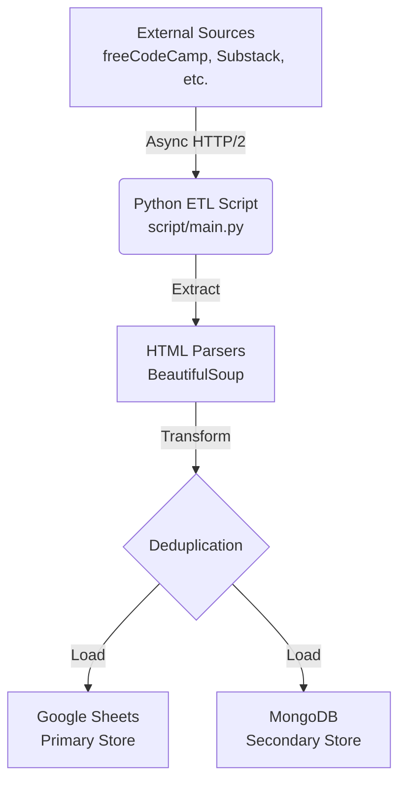
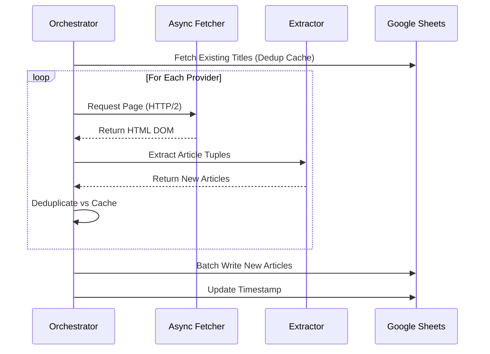

# Extraction Architecture

The extraction layer is an **async web scraping ETL pipeline** that aggregates articles from multiple sources into centralized data stores.

## High-Level System Design

## Core Components

### 1. Orchestration Layer (`script/main.py`)

Coordinates the end-to-end async pipeline.

- **Concurrency:** Uses `asyncio` to manage non-blocking I/O.
- **Lifecycle:** Manages authentication, fetcher state, and final database writes.

### 2. Extraction Layer (`utils/get_page.py`)

Handles network interactions with resilience.

- **Features:** HTTP/2 support, connection pooling, and stateful rate-limiting (1s intervals).
- **Safety:** Graceful degradation on timeouts or non-200 responses.

### 3. Transformation Layer (`utils/extractors.py`)

Provider-specific logic to turn raw HTML into structured data.

- **Routing:** Selects the correct parser based on the domain.
- **Normalization:** Standardizes dates to ISO 8601 and titles to lowercase for deduplication.

### 4. Load Layer (`utils/sheet.py` & `mongo.py`)

Dual-write strategy for data redundancy.

- **Primary:** Batch writes to Google Sheets for the dashboard.
- **Secondary:** Optional batch writes to MongoDB for structured querying.

## Extraction Sequence

## References

- **Data Schemas:** See [schemas.md](schemas.md) for Article tuples and MongoDB document definitions.
- **Automation:** See [operations.md](operations.md) for the daily extraction schedule.
