# Extraction Architecture

This document outlines the structure, components, and data flow of the article extraction pipeline.

## Overview

The extraction layer is a **web scraping ETL (Extract, Transform, Load) module** that orchestrates automated article extraction from multiple sources and loads them into centralized data stores (Google Sheets + MongoDB). Built with **Beautiful Soup for HTML parsing**, **httpx for async HTTP/2 requests**, and **asyncio for concurrent processing**, the architecture showcases modern data pipeline patterns: source aggregation, data transformation, deduplication, dual-store writes, and reproducible extraction—all without requiring dedicated infrastructure.

## High-Level Data Flow (ETL Pipeline)

```mermaid
graph TD
    A["📰 Article Sources"] --> B["freeCodeCamp<br/>GitHub Blog<br/>Shopify<br/>Substack<br/>Stripe Blog"]
    B -->|Extract: Async HTTP/2| C["🌐 Web Scraper Module<br/>httpx + asyncio"]
    C -->|Transform: Parse HTML| D["🔍 Article Extractors<br/>5 provider-specific parsers"]
    D -->|Transform: Deduplicate| E["☁️ Dual-Store Write"]
    E -->|Load| F["📊 Google Sheets<br/>articles + providers"]
    E -->|Load| G["🗄️ MongoDB<br/>article documents"]
    F -->|Read for dedup| D
```



**ETL Pipeline Stages:**

1. **Extract**: Fetch web pages asynchronously from configured provider URLs via HTTP/2 requests
2. **Transform**: Parse HTML using Beautiful Soup and extract structured article data (5 provider-specific extractors)
3. **Transform**: Deduplicate against existing titles from Google Sheets for data quality
4. **Load**: Batch write to dual stores (Google Sheets + MongoDB) for redundancy and analytics
5. **Finalize**: Sort Google Sheet by date and update timestamp metadata

## Project Setup & Configuration

### Project Structure

```plaintext
personal-reading-analytics-dashboard/
├── script/                 # Python extraction pipeline
│   ├── main.py            # Entry point & async orchestration
│   ├── tests/             # Pytest test suite
│   └── utils/             # Core utility modules
│       ├── __init__.py    # Package exports
│       ├── sheet.py       # Google Sheets API interactions
│       ├── mongo.py       # MongoDB integration
│       ├── get_page.py    # Async HTTP/2 client & rate limiting
│       ├── extractors.py  # 5 provider-specific article parsers
│       ├── format_date.py # Date/time utilities
│       └── constants.py   # Configuration constants
├── requirements.txt        # Python dependencies
├── credentials.json        # Google API credentials (gitignored)
├── Makefile                # Development commands
└── docs/                   # Documentation (dashboard_architecture.md, etc.)
```

### Dependencies

#### External Libraries

- **gspread** - Google Sheets API client (synchronous)
- **google-auth** - Google OAuth 2.0 authentication
- **beautifulsoup4** - HTML/XML parsing library
- **httpx** - Async HTTP/2 client with connection pooling
- **pymongo** - MongoDB driver (synchronous) for dual-store writes
- **python-dotenv** - Environment variable management

#### External Services

- **Google Sheets API** - Primary data store and deduplication source
- **Google OAuth 2.0** - Service account authentication
- **MongoDB Atlas** - Secondary data store for article documents (optional)

### Configuration

#### Environment Variables

- `SHEET_ID` - Google Sheet ID (required for Google Sheets)
- `CREDENTIALS_PATH` - Path to Google service account JSON (default: `./credentials.json`)
- `MONGO_URI` - MongoDB connection string (optional, enables dual-store writes)
- `MONGO_DB_NAME` - MongoDB database name (optional, used with `MONGO_URI`)
- `MONGO_COLLECTION_NAME` - MongoDB collection name (optional, used with `MONGO_URI`)

#### Rate Limiting & HTTP Configuration

Configured in `utils/constants.py`:

- `DEFAULT_REQUEST_INTERVAL`: 1.0 second between requests (respectful crawling)
- `DEFAULT_TIMEOUT`: 30 seconds per HTTP request
- **HTTP/2 protocol**: Enabled via `httpx.AsyncClient(http2=True)` for performance
- **Connection pooling**: Single client reused across all requests (state management)

## Core Components (Pipeline Stages)

### 1. **Orchestration Layer** (`main.py`)

Coordinates the **async ETL pipeline** end-to-end with `asyncio` for concurrent operations. Key responsibilities:

- **Async main loop**: `async_main()` orchestrates provider processing with `await` for non-blocking I/O
- **HTTP client lifecycle**: Initializes fetcher state, reuses client across requests, closes on completion
- **Provider iteration**: Processes each provider sequentially (can be parallelized with `asyncio.gather()`)
- **Deduplication setup**: Loads existing titles from Google Sheets before extraction
- **Dual-store writes**: Batch appends to Google Sheets, then MongoDB (if configured)
- **Finalization**: Sorts Google Sheet by date, updates timestamp in cell (1, 6)
- **Logging**: Configures centralized logging to stdout with INFO level, suppresses httpx noise

**Entry point**: `main()` wrapper calls `asyncio.run(async_main(timestamp))` for sync-to-async bridge

### 2. **Extraction Layer** (`utils/get_page.py`)

Handles **async HTTP/2 data extraction** with stateful rate limiting and connection pooling:

**Fetcher State Management**:
- `init_fetcher_state()`: Creates dict with `last_request_time`, `request_interval`, and `httpx.AsyncClient`
- State passed through pipeline, enabling connection reuse across all provider requests
- HTTP/2 enabled: `httpx.AsyncClient(timeout=30.0, http2=True)` for multiplexing support

**Rate Limiting Implementation**:
- Tracks elapsed time since last request using `time.time()`
- Sleeps asynchronously if interval not met: `await asyncio.sleep(delay)`
- Default interval: 1.0 second (configurable via `DEFAULT_REQUEST_INTERVAL`)

**Request Execution**:
- `fetch_page(state, url)`: Returns `(BeautifulSoup | None, updated_state)` tuple
- HTTP 200: Parses with BeautifulSoup, returns parsed DOM
- Non-200 or exception: Returns `None` (silent failure for graceful degradation)
- Updates `last_request_time` after each request for accurate rate limiting

**Cleanup**: `close_fetcher(state)`: Calls `await state["client"].aclose()` for graceful shutdown

### 3. **Transform Layer** (`utils/extractors.py`)

Provider-specific HTML parsers that extract structured article data as `(date, title, link, source)` tuples. **5 extractors implemented**:

1. **freeCodeCamp** (`extract_fcc_articles`): Extracts from `<h2>` title, `<a href>`, and `<time datetime>` elements
2. **Substack** (`extract_substack_articles`): Uses `data-testid="post-preview-title"` attributes and ISO date parsing
3. **GitHub** (`extract_github_articles`): Parses `<h3>` titles, `Link--primary` class, and `<time datetime>`
4. **Shopify** (`extract_shopify_articles`): Complex class-based selectors, converts "MMM DD, YYYY" to ISO format
5. **Stripe** (`extract_stripe_articles`): Extracts from `BlogIndexPost__titleLink` class, handles relative URLs

**Error Handling Decorator** (`@extractor_error_handler`):
- Wraps each extractor function for uniform exception handling
- Logs error with 300-character HTML snippet for debugging context
- Includes full traceback via `traceback.format_exc()`
- Raises exception after logging (caught in `get_articles()` generator)

**Deduplication Generator** (`get_articles()`):
- Normalizes titles to lowercase for case-insensitive comparison
- Checks against `existing_titles` set (O(1) lookup)
- Yields only new articles, skips duplicates silently
- Exception handling: Catches extractor errors, continues processing remaining articles

**Provider Dictionary** (`provider_dict()`):
- Maps provider name → `{"element": lambda, "extractor": func}`
- `element` returns CSS selector or Beautiful Soup kwargs
- Enables dynamic provider lookup in orchestration layer

### 4. **Transform Layer: Deduplication** (`utils/sheet.py` - read phase)

Retrieves existing article titles from Google Sheet for deduplication logic. Ensures data quality and prevents duplicate entries in the aggregated dataset.

### 5. **Load Layer** (`utils/sheet.py` + `utils/mongo.py`)

Handles **dual-store writes** for redundancy and analytics flexibility:

**Google Sheets Load** (`utils/sheet.py`):
- **Authentication**: `get_client()` uses service account credentials with `gspread.authorize()`
- **Worksheet access**: `get_worksheet()` opens by sheet ID and worksheet name
- **Batch append**: `batch_append_articles(sheet, articles)` writes all articles in single API call
- **Sort operation**: `articles_sheet.sort((1, "des"))` sorts by column 1 (date) descending
- **Timestamp update**: `update_cell(1, 6, timestamp)` writes "Updated at" metadata to cell F1
- **Deduplication source**: `get_all_titles()` retrieves existing titles as set for O(1) lookup
- **Provider config**: `get_all_providers()` reads provider sheet as list of dicts

**MongoDB Load** (`utils/mongo.py`):
- **Optional writes**: Only executes if `MONGO_URI` environment variable set
- **Client creation**: `get_mongo_client()` returns `MongoClient` or `None` if not configured
- **Document transformation**: `batch_insert_articles_to_mongo()` converts tuples to MongoDB documents:
  ```python
  {
    "extracted_at": "2025-12-22T10:30:00Z",
    "source": "freecodecamp",
    "article": {"title": "...", "link": "...", "published_date": "2025-01-15"},
    "domain": "freecodecamp.org",
    "status": "ingested"
  }
  ```
- **Batch insert**: Uses `insert_many()` for efficient bulk writes
- **Domain extraction**: Uses `urlparse()` to extract domain from article links
- **Connection cleanup**: `mongo_client.close()` after batch write

**Dual-Store Benefits**:
- Google Sheets: Human-readable, easy manual edits, dashboard data source
- MongoDB: Structured queries, analytics flexibility, machine learning pipelines

### 6. **Utilities** (`utils/format_date.py`, `utils/constants.py`)

Shared utilities for date transformation and configuration management used across all pipeline stages.

## Data Models (Schema)


**Provider Schema** (Configuration - `providers` worksheet in Google Sheets):

- `name`: Provider identifier (e.g., "freecodecamp", "github") - Used for extractor routing and logging
- `element`: CSS selector for article elements on the page - Enables provider-specific parsing via Beautiful Soup
- `url`: Source website URL - HTTP endpoint for extraction

**Article Schema** (Tuple representation during pipeline processing):

- `date`: Publication date (YYYY-MM-DD format) - Used for sorting and chronological ordering
- `title`: Article headline - Deduplication key (normalized to lowercase)
- `link`: Full URL to the article - Navigation/reference
- `source`: Provider name (foreign key to providers) - Data lineage tracking

**Google Sheets Storage** (`articles` worksheet):

- Row format: `[date, title, link, source]` (columns A-D)
- Header row skipped during title retrieval
- Sorted by date descending after each batch write
- Cell F1 contains "Updated at" timestamp metadata

**MongoDB Document Schema** (optional secondary storage):

```json
{
  "extracted_at": "2025-12-22T10:30:00.123456+00:00",
  "source": "freecodecamp",
  "article": {
    "title": "Understanding Async Python",
    "link": "https://www.freecodecamp.org/news/async-python",
    "published_date": "2025-01-15"
  },
  "domain": "freecodecamp.org",
  "status": "ingested"
}
```

Fields:
- `extracted_at`: UTC timestamp when article was extracted (ISO 8601 with timezone)
- `source`: Provider name (matches Google Sheets `source` column)
- `article.title`: Article headline
- `article.link`: Full article URL
- `article.published_date`: Publication date in YYYY-MM-DD format
- `domain`: Extracted domain from article link (via `urlparse()`)
- `status`: Processing state (always "ingested" for newly extracted articles)

The dual-store schema demonstrates **polyglot persistence**: Google Sheets for human access and dashboard integration, MongoDB for structured queries and analytics.

## Processing Flow (Pipeline Execution)

```mermaid
flowchart TD
    Start["🚀 Start"]
    Init["Initialize<br/>Setup logging & fetcher state"]
    GetProviders["Read Configuration<br/>Fetch Providers from Sheet"]
    GetTitles["Load Dedup Cache<br/>Get Existing Titles (set)"]
    
    Start --> Init --> GetProviders --> GetTitles
    
    Process["Process Each Provider<br/>(Sequential Loop)"]
    Skip["⏭️ Skip Duplicate"]
    Fetch["Extract: Fetch Webpage<br/>Async HTTP/2 with Rate Limit"]
    Parse["Transform: Parse HTML<br/>BeautifulSoup"]
    Extract["Transform: Extract Articles<br/>Provider-specific extractor"]
    CheckDup{"Deduplicate<br/>check?"}
    Collect["Collect Article<br/>in all_articles list"]
    
    GetTitles --> Process
    Skip --> Process
    Process --> Fetch --> Parse --> Extract --> CheckDup
    CheckDup -->|Duplicate| Skip
    CheckDup -->|New| Collect --> Process
    
    AllDone["All providers<br/>processed?"]
    BatchSheets["Load: Batch Write<br/>to Google Sheets"]
    MongoCheck{"MongoDB<br/>configured?"}
    BatchMongo["Load: Batch Write<br/>to MongoDB"]
    CloseMongo["Close MongoDB<br/>Connection"]
    Sort["Finalize: Sort Articles<br/>by date descending"]
    Update["Finalize: Update Timestamp<br/>Cell F1"]
    CloseFetcher["Cleanup: Close<br/>HTTP Client"]
    Log["Finalize: Log Results"]
    Complete["✅ Pipeline Complete"]
    
    Process -->|Yes| AllDone
    AllDone -->|Articles found| BatchSheets --> MongoCheck
    AllDone -->|No articles| Log
    MongoCheck -->|Yes| BatchMongo --> CloseMongo --> Sort
    MongoCheck -->|No| Sort
    Sort --> Update --> CloseFetcher --> Log --> Complete
```



**Pipeline Guarantees:**

- **Async non-blocking I/O**: HTTP requests use `await` for concurrent processing potential
- **Batch writes**: All articles collected in memory, written in single API call to each store
- **Dual-store consistency**: Google Sheets written first (authoritative), then MongoDB (optional)
- **Deduplication idempotency**: Title-based dedup prevents reruns from creating duplicates
- **Rate limiting**: 1-second interval enforced via async sleep between HTTP requests
- **Data consistency**: Google Sheets sorted after load; timestamp updated in cell F1
- **Fault isolation**: Provider errors don't cascade; pipeline continues processing remaining providers
- **Graceful degradation**: MongoDB failures don't block pipeline (logged and continued)
- **Connection cleanup**: HTTP client and MongoDB connections closed on completion

## Error Handling & Resilience

The pipeline implements **async fault-tolerant design** with layered error boundaries:

**1. Provider-level fault isolation** (`main.py:process_provider()`):
- Each provider wrapped in `try/except` block
- Exceptions logged with full traceback: `logger.error(f"Error processing {provider_name}: {str(e)}", exc_info=True)`
- Returns empty list on failure; pipeline continues with next provider
- Failed provider doesn't prevent other providers from processing

**2. Extraction error boundaries** (`utils/extractors.py:@extractor_error_handler`):
- Decorator wraps each extractor function (freeCodeCamp, GitHub, Shopify, Substack, Stripe)
- Logs error with 300-character HTML snippet for debugging context
- Includes full traceback via `traceback.format_exc()`
- Re-raises exception; caught in `get_articles()` generator with silent skip

**3. Network resilience** (`utils/get_page.py:fetch_page()`):
- HTTP timeout: 30 seconds via `httpx.AsyncClient(timeout=30.0)`
- Exceptions caught with `except Exception:` → returns `(None, state)`
- Non-200 status codes: Returns `(None, state)` for graceful degradation
- Warning logged in `main.py` when `soup` is `None`: "Failed to fetch page for {provider_name}"
- Rate limiting prevents overwhelming servers: `await asyncio.sleep(delay)`

**4. Google Sheets API error handling**:
- Authentication errors fail fast on `get_client()` (no graceful degradation)
- `SHEET_ID` validated on import: `ValueError` if missing
- API errors during writes propagate to top level (logged in workflow)
- Transient failures can be retried by re-running pipeline (idempotent deduplication)

**5. MongoDB error handling** (`utils/mongo.py`):
- **Optional store**: Missing `MONGO_URI` → `get_mongo_client()` returns `None` (not an error)
- Connection failures: Logged with `logger.error()`, pipeline continues
- Insert failures: Logged with full error message, Google Sheets write still succeeds
- Connection cleanup: Always attempted in `finally`-style pattern (`mongo_client.close()`)

**6. Graceful degradation patterns**:
- Failed articles silently skipped in `get_articles()` generator (exception caught, `pass`)
- Missing soup from `fetch_page()` → warning logged, provider returns empty list
- MongoDB unavailable → pipeline completes with Google Sheets data only
- Malformed HTML → extractor error logged, next article processed

**Idempotent Operations**:

- **Deduplication check**: Title normalization (lowercase) prevents case-sensitive duplicates on reruns
- **Timestamp updates**: Cell F1 overwritten each run (safe for retries)
- **Sheet sorting**: Deterministic date-based sort produces same order on reruns
- **MongoDB inserts**: No duplicate checking (assumes Google Sheets is authoritative dedup source)

**Logging Strategy** (centralized error visibility):

- High-level events in `main.py`: Provider processing start/success, batch write completion
- Low-level errors in utility modules: Extractor failures, HTTP errors (detailed with snippets)
- MongoDB errors: Connection failures, insert failures (with error messages)
- httpx noise suppressed: `logging.getLogger("httpx").setLevel(logging.CRITICAL)`
- This produces clean logs while maintaining full error context for debugging

## Logging & Observability

Structured logging enables operational visibility with **async-aware context**:

**Log Configuration** (`main.py`):

- **Level**: `INFO` (production-grade)
- **Format**: `"%(asctime)s - %(name)s - %(levelname)s - %(message)s"`
- **Date Format**: `"%Y-%m-%d %H:%M:%S"` (without milliseconds for readability)
- **Output**: `sys.stdout` (captured by GitHub Actions logs and Docker)
- **httpx Suppression**: `logging.getLogger("httpx").setLevel(logging.CRITICAL)` to reduce HTTP noise
- **Centralized Setup**: All logging configured in `main.py` before async execution

**Key Log Messages** (Observable Events):

| Event | Log Message | Level | Location |
|-------|-------------|-------|----------|
| Pipeline start | `"The process is starting at {timestamp}"` | INFO | `main.py` print statement |
| Provider processing | `"Processing {provider_url} - {count} new articles found"` | INFO | `main.py:process_provider()` |
| Failed fetch | `"Failed to fetch page for {provider_name} from {provider_url}"` | WARNING | `main.py:process_provider()` |
| Provider error | `"Error processing {provider_name}: {error}"` | ERROR | `main.py:process_provider()` with `exc_info=True` |
| Unknown provider | `"Unknown provider: {provider_name}"` | INFO | `main.py:process_provider()` |
| Batch write success | `"Batch write complete: {count} articles added to the sheet."` | INFO | `main.py:async_main()` |
| MongoDB success | `"Successfully inserted {count} articles into MongoDB"` | INFO | `utils/mongo.py:batch_insert_articles_to_mongo()` |
| MongoDB connection error | `"Could not connect to MongoDB: {error}"` | ERROR | `utils/mongo.py:get_mongo_client()` |
| MongoDB insert error | `"Could not insert articles into MongoDB: {error}"` | ERROR | `utils/mongo.py:batch_insert_articles_to_mongo()` |
| No articles found | `"\n✅ No new articles found\n"` | INFO | `main.py:async_main()` |
| Extractor error | `"Error extracting {site_name} article: {error}\nArticle snippet: {html}\nTraceback: {tb}"` | ERROR | `utils/extractors.py:@extractor_error_handler` |
| Pipeline completion | `"The process is completed"` | INFO | `main.py` print statement |

**Observability Characteristics**:

- **Async context preserved**: Logging works correctly within `async def` functions
- **Traceback inclusion**: `exc_info=True` provides full stack traces for errors
- **HTML snippets**: Extractor errors include 300-character HTML snippet for debugging
- **Centralized view**: Utility modules delegate to application-level logging
- **Metrics extraction**: Log messages enable monitoring new article counts, error rates, provider health
- **GitHub Actions integration**: Stdout logs captured in workflow artifacts
- **Docker compatibility**: Stdout logging works with `docker logs` command

These logs enable downstream **monitoring, alerting, and audit trails**—essential for operational data pipelines.

## Performance & Architecture

### Execution Model

- **Async I/O**: Uses `asyncio` and `async/await` for non-blocking HTTP requests
- **Sequential provider processing**: Providers processed one at a time (can be parallelized with `asyncio.gather()`)
- **HTTP/2 multiplexing**: Enabled via `http2=True` in httpx client (not fully utilized due to sequential processing)
- **Connection pooling**: Single `httpx.AsyncClient` reused across all requests (state management pattern)
- **Batch writes**: Collects all articles in memory, then single API call per store (Google Sheets, MongoDB)
- **Memory efficiency**: Articles stored as tuples in list (`all_articles`), minimal overhead until batch write
- **Generator-based deduplication**: `get_articles()` yields articles on-demand, but currently consumed into list

### Rate Limiting & Respect

- **Request interval**: 1.0 second between HTTP requests (configurable via `DEFAULT_REQUEST_INTERVAL`)
- **Async sleep**: `await asyncio.sleep()` for non-blocking delays (CPU available for other tasks)
- **HTTP timeout**: 30 seconds per request (prevents hanging on slow sites)
- **Rate limit enforcement**: Tracks `last_request_time`, calculates elapsed, sleeps if needed
- **Respectful crawling**: Prevents overwhelming target servers, reduces chance of rate limiting/bans

### Data Quality

- **Deduplication**: Title-based check with lowercase normalization (case-insensitive)
- **Set-based lookup**: Existing titles stored as `set()` for O(1) duplicate checking
- **Sorting**: Articles sorted by date descending after load (most recent first)
- **Dual-store validation**: MongoDB write failures don't corrupt Google Sheets (independent writes)
- **Timestamp metadata**: Cell F1 tracks last successful run time

### Scalability Path

- **Parallelization ready**: Replace `for provider in providers` with `await asyncio.gather(*tasks)` for concurrent extraction
- **HTTP/2 benefits**: Multiplexing enables multiple requests over single TCP connection (if parallelized)
- **Provider extensibility**: Adding new providers requires only:
  1. Entry in Google Sheet `providers` worksheet
  2. New extractor function in `utils/extractors.py`
  3. Entry in `provider_dict()` mapping
- **Generator architecture**: `get_articles()` supports streaming (currently not used, but ready for incremental processing)
- **MongoDB scalability**: Document-based storage enables horizontal scaling, analytics pipelines, machine learning
- **Current limits**: Sequential processing + batch collection means large provider lists may cause memory issues (mitigated by typical article counts < 100/provider)

### Async Concurrency Potential (Future Enhancement)

**Current**: Sequential provider loop, single HTTP request at a time
```python
for provider in providers:
    articles, state = await process_provider(state, provider, existing_titles)
    all_articles.extend(articles)
```

**Parallelized** (would require multiple HTTP clients or client sharing strategy):
```python
tasks = [process_provider(state, p, existing_titles) for p in providers]
results = await asyncio.gather(*tasks, return_exceptions=True)
for articles, _ in results:
    all_articles.extend(articles)
```

Benefit: Extract from all providers concurrently (respects rate limiting per provider), reduces total pipeline time from O(n) to O(1) where n = provider count.
