# GitHub Actions Workflows Guide

This document describes all GitHub Actions workflows that automate the Personal Reading Analytics Dashboard project.

## Overview

The project uses five automated workflows organized by development pipeline: **code quality validation** → **data collection** → **metrics calculation** → **visualization deployment**:

1. **Go Format Checking** - Validates Go code formatting (on PR & push)
2. **Python Ruff Checking** - Validates Python code quality (on PR & push)
3. **Daily Extraction** - Extracts articles from web sources (daily at 6am UTC)
4. **Generate Weekly Metrics** - Calculates metrics from Google Sheets (Friday at 1am UTC)
5. **Deploy to GitHub Pages** - Generates and deploys dashboard (Monday at 1am UTC + on push)

## 1. Go Format Checking Workflow

**File**: `.github/workflows/go_lint.yml`

### Purpose 1

Validates Go code formatting and runs static analysis checks on pull requests and main branch pushes. First quality gate for Go code.

### Trigger 1

- **Pull request**: Triggered when PR includes changes to `cmd/**` paths
- **Push to main**: Triggered when code pushed to main with `cmd/**` changes

### Execution Steps 1


### Output 1

- **Success**: ✅ Go code is properly formatted
- **Failure**: ❌ Go code not formatted + suggestion to run `gofmt -w ./cmd/`
- **Exit code**: 0 (pass) or 1 (fail, blocks merge)

### Validation Checks 1

- **gofmt**: Code style consistency (spacing, indentation, naming conventions)
- **go vet**: Static analysis for common bugs and issues

### Key Features 1

- **Pre-merge validation**: Prevents improperly formatted code from merging
- **Auto-suggestion**: Provides fix command in error message
- **Scope-specific**: Only runs when Go files in `cmd/` are modified
- **No modifications**: Only checks, doesn't auto-fix

---

## 2. Python Ruff Checking Workflow

**File**: `.github/workflows/py_lint.yml`

### Purpose 2

Validates Python code quality using Ruff linter on pull requests and main branch pushes. Second quality gate for Python code.

### Trigger 2

- **Pull request**: Triggered when PR includes changes to `src/**` paths
- **Push to main**: Triggered when code pushed to main with `src/**` changes

### Execution Steps 2


### Output 2

- **Success**: Exit code 0 (no violations)
- **Exit code**: 1 + diff showing violations (blocks merge)

### Validation Checks 2

- **Code quality**: Unused imports, undefined names, syntax errors
- **Style violations**: PEP 8 compliance issues
- **Common pitfalls**: Potential bugs and anti-patterns

### Key Features 2

- **Diff output**: Shows exact violations with context
- **Scope-specific**: Only runs when Python files in `src/` are modified
- **Pre-merge validation**: Prevents code quality regression
- **No modifications**: Only checks, doesn't auto-fix

---

## 3. Daily Extraction Workflow

**File**: `.github/workflows/scheduled_extraction.yml`

### Purpose 3

Runs Python web scraping script to extract articles from configured providers and load into Google Sheets. Keeps data fresh daily.

### Trigger 3

- **Schedule**: Daily at 6:00 AM UTC
- **Manual trigger**: `workflow_dispatch` button in GitHub UI

### Execution Steps 3


### Output 3

- **Artifacts**: `extraction-log-YYYY-MM-DD.txt` (uploaded to workflow run)
- **Google Sheets**: Updated with new articles
- **Log format**: Timestamped with script output

### Key Features 3

- **Daily automation**: Runs without manual intervention
- **Logging**: Captures stdout/stderr to log file
- **Credentials cleanup**: Deletes sensitive files after use
- **Artifact preservation**: Logs available for review for 90 days (GitHub default)
- **Error visibility**: Script failures visible in GitHub UI

### Environment Variables 3

- `SHEET_ID` - From `secrets.SHEET_ID` (passed to Python script)
- `CREDENTIALS` - From `secrets.CREDENTIALS` (written to file)

---

## 4. Generate Weekly Metrics Workflow

**File**: `.github/workflows/generate-metrics.yml`

### Purpose 4

Fetches articles from Google Sheets API, calculates comprehensive metrics, and creates a pull request with the results. Happens after articles have been collected throughout the week.

### Trigger 4

- **Schedule**: Friday at 1:00 AM UTC (weekly)
- **Manual trigger**: `workflow_dispatch` button in GitHub UI
- **No automatic push**: Uses PR for review before merging to main

### Permissions 4

```yaml
permissions:
  contents: write         # Create/push branches
  pull-requests: write    # Create pull requests
```

### Execution Steps 4


### Output 4

- **Branch**: `metrics/weekly-update` (recreated each run)
- **Files changed**: `metrics/YYYY-MM-DD.json` (new metrics file)
- **Pull Request**: Auto-created with title "chore: weekly metrics update"
- **Artifact**: None (results stored in branch)

### Key Features 4

- **Credentials handling**: Creates file from secret, deletes after use (never committed)
- **Safe push**: Uses `--force-with-lease` to prevent overwriting concurrent updates
- **PR-based**: Requires approval before merging (respects branch protection)
- **Idempotent PR creation**: Uses `|| true` to avoid error if PR already exists
- **Error recovery**: Continues pipeline even if no changes (via `|| echo`)

### Environment Variables 4

Set as GitHub Secrets:

- `CREDENTIALS` - Google service account JSON (entire file as string)
- `SHEET_ID` - Google Sheet ID to fetch articles from

---

## 5. Deploy to GitHub Pages Workflow

**File**: `.github/workflows/deploy_pages.yml`

### Purpose 5

Generates interactive HTML dashboard from latest metrics JSON and deploys to GitHub Pages. Final step in the pipeline—makes data publicly visible.

### Trigger 5

- **Schedule**: Monday at 1:00 AM UTC (weekly)
- **On push**: Triggers when code pushed to `main` branch
- **Manual trigger**: `workflow_dispatch` button in GitHub UI

### Permissions 5

```yaml
permissions:
  contents: read         # Read repository code
  pages: write           # Deploy to GitHub Pages
  id-token: write        # OpenID Connect token for deployment
```

### Concurrency

```yaml
concurrency:
  group: "pages"
  cancel-in-progress: false    # Wait for previous deploy to complete
```

### Execution Steps 5


### Output 5

- **Dashboard**: `site/index.html` (generated locally, uploaded as artifact)
- **GitHub Pages URL**: `https://victoriacheng15.github.io/personal-reading-analytics/`
- **Deployment time**: ~1-2 minutes
- **Artifact**: Temporary (auto-deleted after deployment)

### Key Features 5

- **Latest metrics**: Automatically uses most recent `metrics/YYYY-MM-DD.json`
- **No credentials needed**: Dashboard generator reads only local JSON files
- **Concurrency protection**: Only one deploy at a time (prevents race conditions)
- **Automatic environment**: GitHub Pages environment auto-configured
- **Safe deployment**: Previous deployments are not cancelled mid-stream

### Deployment Requirements

Dashboard only runs on Monday schedule **after** metrics have been generated and merged to main. This ensures latest data is visualized.

---

## Workflow Coordination

```mermaid
graph TD
    DailyExt["☀️ Daily Extraction<br/>6am UTC daily"]
    WeeklyMetrics["📊 Weekly Metrics<br/>Friday 1am UTC"]
    MondayDeploy["🚀 Deploy Dashboard<br/>Monday 1am UTC"]
    CodeQA["✓ Code QA<br/>On PR & push"]
    
    DailyExt -->|Updates Google Sheets| WeeklyMetrics
    WeeklyMetrics -->|Metrics PR| MondayDeploy
    CodeQA -->|Validates| WeeklyMetrics
    CodeQA -->|Validates| DailyExt
    MondayDeploy -->|Live Dashboard| Pages["🌐 GitHub Pages"]
```



### Data Flow Timeline

**Week cycle:**

1. **Daily** (6am UTC): Articles extracted → Google Sheets updated
2. **Friday 1am UTC**: Metrics calculated → PR created → awaits review
3. **Friday-Sunday**: Manual approval/merge of metrics PR
4. **Monday 1am UTC**: Dashboard generated from latest metrics → deployed to GitHub Pages
5. **Monday onwards**: Live dashboard with latest data available at GitHub Pages URL

### Failure Modes & Recovery

| Workflow | Failure | Recovery |
|----------|---------|----------|
| Extraction | API error | Manual retry via `workflow_dispatch` or wait for next daily run |
| Metrics generation | Google Sheets unreachable | PR not created, retry next Friday or manually trigger |
| Dashboard deploy | Metrics file missing | Fails with error, waits for metrics PR to be merged |
| Code QA | Formatting issue | Fix code and push, workflow re-runs automatically |

---

## GitHub Secrets Configuration

Required secrets in GitHub repository Settings → Secrets and variables → Actions:

| Secret | Example | Purpose |
|--------|---------|---------|
| `CREDENTIALS` | `{"type": "service_account", ...}` | Google service account JSON (entire JSON as string) |
| `SHEET_ID` | `1a2b3c4d5e6f7g8h` | Google Sheet ID for articles data |

### Setup Instructions

1. Navigate to repository Settings → Secrets and variables → Actions
2. Click "New repository secret"
3. Add `CREDENTIALS`: Paste entire Google service account JSON
4. Add `SHEET_ID`: Paste Google Sheet ID
5. Save and workflows will use them automatically

---

## Monitoring & Debugging

### View Workflow Runs

1. Go to **Actions** tab in GitHub
2. Select workflow name
3. Click run to see detailed logs

### Common Issues

**Metrics workflow fails to create PR:**

- Check `CREDENTIALS` and `SHEET_ID` secrets are set
- Verify Google service account has Sheets API access
- Check branch protection rules allow actions

**Dashboard fails to deploy:**

- Ensure metrics PR is merged to main before Monday 1am UTC
- Check GitHub Pages is enabled in Settings → Pages
- Verify `site/index.html` was generated correctly

**Code QA fails:**

- Go linting: Run `make gofmt` locally to format code
- Python linting: Run `ruff check src/` locally to see violations

### Logs Location

- **GitHub UI**: Actions tab → workflow run → step logs
- **Artifacts**: Actions tab → workflow run → Artifacts section
- **Retention**: 7 days
