# Jenkins CI/CD

This document explains the Jenkins pipeline used to automate Docker image builds and publishing to GitHub Container Registry (GHCR).

## Overview

Jenkins was added to this project mainly out of curiosity—to see how Jenkins CI/CD compares to GitHub Actions for automating Docker image builds and publishing to GHCR. The pipeline is defined in the [`Jenkinsfile`](../Jenkinsfile) at the project root and is typically run on a self-hosted Jenkins server (often via Docker Compose). This setup is not strictly required, but provides a hands-on comparison of two popular automation platforms.

## Pipeline Workflow

**Trigger Events:**

- Manual build via Jenkins UI

### Pipeline Stages

- **Clean Workspace**
  - Deletes all files in the Jenkins workspace to ensure a clean build environment and prevent conflicts from previous runs.

- **Code Formatting Check**
  - Runs in a Python 3.12 Docker container.
  - Installs `ruff` and checks code formatting for `main.py` and all files in `utils/`.
  - Fails the build if formatting issues are detected (shows a diff in the logs).

- **Build, Tag, Push (Docker)**
  - Builds the Docker image and tags it with the Jenkins build number.
  - Logs into GitHub Container Registry (GHCR) using a GitHub PAT stored as `GHCR_PAT` in Jenkins credentials.
  - Pushes the versioned image (`ghcr.io/victoriacheng15/articles-extractor:<build_number>`) to GHCR.
  - Tags the same image as `latest` and pushes that tag as well.
  - Logs out of GHCR at the end of the stage.

**Key Benefit:** Ensures a reproducible, versioned Docker image is always available in the registry for deployment or local use.

### Visualize the Workflow

```mermaid
graph TD
    Start["🚀 Start"] --> Clean["Clean Workspace<br/>Delete old files"]
    Clean --> Format["Code Formatting Check<br/>ruff format check"]
    Format -->|Pass| Build["Build Docker Image<br/>Tag with BUILD_NUMBER"]
    Format -->|Fail| End1["❌ Build Failed"]
    Build --> Login["Login to GHCR<br/>Authenticate with PAT"]
    Login --> PushVersion["Push Versioned Image<br/>ghcr.io/.../article-extractor:N"]
    PushVersion --> PushLatest["Push Latest Tag<br/>ghcr.io/.../articles-extractor:latest"]
    PushLatest --> Logout["Logout from GHCR<br/>Cleanup credentials"]
    Logout --> End2["✅ Pipeline Complete"]
```



---

## Prerequisites

- Jenkins server (can be run via Docker Compose)
- Docker installed on the Jenkins host
- Jenkins container must have access to the Docker daemon and CLI (see below)
- GitHub PAT with `write:packages` scope stored in Jenkins credentials as `GHCR_PAT`

**Example `docker-compose.yaml`:**

```yaml
services:
  image: jenkins/jenkins:lts
  container_name: jenkins_server
  user: root
  ports:
    - "8080:8080"
    - "50000:50000"
  volumes:
    - /var/run/docker.sock:/var/run/docker.sock
    - jenkins_data:/var/jenkins_home
    - /usr/bin/docker:/usr/bin/docker
  env_file:
    - .env

volumes:
  jenkins_data:
```

For the complete Docker Compose setup, refer to the [`docker-compose.yml`](https://github.com/victoriacheng15/home-server/blob/main/docker-compose.yml) file in the `home-server` repository.

---

## Monitoring & Debugging

### Viewing Pipeline Results

1. Open Jenkins in your browser
2. Select the relevant job
3. Click a build number to view logs and results

### Troubleshooting

- **Workspace contains old or unexpected files**:
  - Use the bash commands:

    ```bash
    docker exec -it jenkins_server bash
    rm -rf /var/jenkins_home/workspace/<job_name>
    ```

  - Or rely on the automated cleanup step included in the pipeline
- **`docker: not found`**: Ensure `/usr/bin/docker` is mounted and Docker is installed on the host
- **Permission errors**: Ensure Jenkins runs as `root` and has access to the Docker socket
- **Credential errors**: Ensure the GitHub PAT is stored as `GHCR_PAT` in Jenkins credentials
- **Python commands fail**:
  - The Code Formatting Check stage runs inside a Python Docker agent (python:3.12-alpine).
  - Ensure the Docker daemon is running and the host can pull/run the Python image.

---

## Lessons Learned

- Jenkins requires more setup and manual configuration compared to GitHub Actions, but provides a hands-on view of pipeline agents, stages, and containerized builds.
- Using a Python Docker agent simplified environment consistency for formatting and dependency management.
- Comparing GitHub Actions and Jenkins helped deepen understanding of CI/CD workflows, container-based builds, and credential management.
- Even manual pipelines are valuable for learning the differences in triggers, agents, and stage orchestration.
