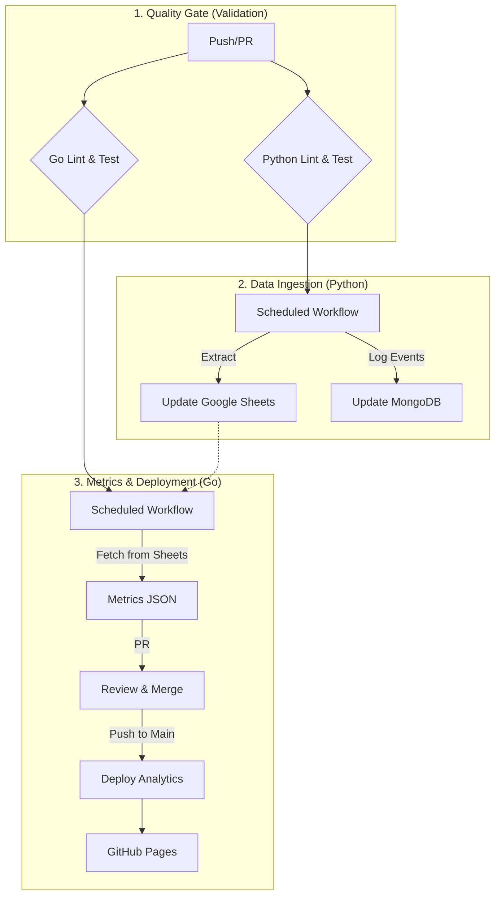

# Operations & CI/CD Guide

This document covers the operational aspects of the project, including local development commands (Makefile) and the automated CI/CD pipeline (GitHub Actions).

## 1. Local Development (Makefile)

The `Makefile` is the primary entry point for running tasks locally.

| Command | Description |
| :--- | :--- |
| `make run-metrics` | Fetches data from Google Sheets and generates `metrics/YYYY-MM-DD.json`. |
| `make run-analytics` | Generates the HTML analytics site in `site/index.html` using the latest metrics. |
| `make cleanup` | Removes compiled binaries (`metricsjson.exe`, `analytics.exe`) and test coverage files. |
| `make go-test` | Runs all Go unit tests with verbose output. |
| `make go-coverage` | Runs Go tests and generates a coverage report. |
| `make gofmt` | Formats all Go code in `cmd/`. |

## 2. CI/CD Pipeline Overview

The project uses five automated workflows to handle quality control, data extraction, metrics generation, and deployment.

### Workflow Reference Table

| Workflow | File | Trigger | Purpose |
| :--- | :--- | :--- | :--- |
| **Go Check** | `go_lint.yml` | PR, Push (`cmd/**`) | Validates Go formatting (`gofmt`), static analysis (`go vet`), and tests. |
| **Python Check** | `py_lint.yml` | PR, Push (`script/**`) | Validates Python code using `ruff` and runs `pytest`. |
| **Daily Extraction** | `extraction.yml` | Schedule (Daily 6am), Manual | Scrapes articles and updates Google Sheets/MongoDB. |
| **Weekly Metrics** | `metrics_generation.yml` | Schedule (Fri 1am), Manual | Calculates metrics and opens a PR with a new JSON file. |
| **Deploy** | `deployment.yml` | Push (`metrics/**`), Manual | Builds static HTML and deploys to GitHub Pages. |

## 3. Configuration & Secrets

All sensitive configuration is managed via GitHub Secrets.

| Secret Name | Required | Description |
| :--- | :--- | :--- |
| `CREDENTIALS` | **Yes** | Google Service Account JSON (full content). |
| `SHEET_ID` | **Yes** | ID of the Google Sheet used for storage. |
| `MONGO_URI` | **Yes** | Connection string for MongoDB (Event Logging). |
| `MONGO_DB_NAME` | **Yes** | MongoDB Database Name. |
| `MONGO_COLLECTION_NAME` | **Yes** | MongoDB Collection Name. |

## 4. Failure Recovery

| Issue | Resolution |
| :--- | :--- |
| **Extraction Fails** | Check `extraction.yml` logs for API errors. Retry manually via `workflow_dispatch`. |
| **Metrics PR Missing** | Check `metrics_generation.yml` logs. Verify `SHEET_ID` access. Run `make run-metrics` locally to debug. |
| **Deploy Fails** | Ensure `metrics/` folder has JSON files. Check `deployment.yml` logs for template errors. |
| **Linting Fails** | Run `make gofmt` or `ruff check script/` locally and commit fixes. |

## 5. Zero-Code Onboarding for New Sources

The project supports "Zero-Code" onboarding for new content providers using the **Google Sheets `providers` worksheet** as the Single Source of Truth (SSOT). Once a new source is added to this sheet, the daily extraction workflow automatically picks it up without requiring any code changes or deployments.

### Onboarding Steps

1. **Open the Providers Worksheet:** Navigate to the Google Sheet associated with `SHEET_ID` and select the `providers` worksheet.
2. **Add a New Row:** Append a new row with the following information:

    | Column        | Description                                                     | Example                                           |
    | :------------ | :-------------------------------------------------------------- | :------------------------------------------------ |
    | `name`        | (Required) Canonical name for display and internal categorization. | `Netflix`                                         |
    | `url`         | (Required) Base URL for RSS feed or HTML page extraction.       | `https://netflixtechblog.com/feed`                |
    | `element`     | (Optional) CSS selector or JSON config for article container.   | `{"container": "article", "title_selector": "h2"}` |
    | `strategy`    | (Required) Extraction strategy: `rss`, `html`, or `substack`.   | `rss`                                             |
    | `brand_color` | (Optional) Hex color code (`#RRGGBB`) for UI theming.           | `#E50914`                                         |
    | `added_date`  | (Optional) Date added to sheet (`YYYY-MM-DD` format).           | `2026-02-15`                                      |

3. **Verification:** The next daily `extraction.yml` GitHub Actions workflow will automatically attempt to fetch articles from the newly added source. Monitor the workflow logs for `extraction.yml` to confirm successful processing.

**Note on `element` field:** For `html` strategy, if left blank, the Universal Extractor will use advanced heuristics to discover article titles and dates. For complex layouts, a JSON object can be provided to specify CSS selectors (`container`, `title_selector`, `date_selector`) for more precise control.
